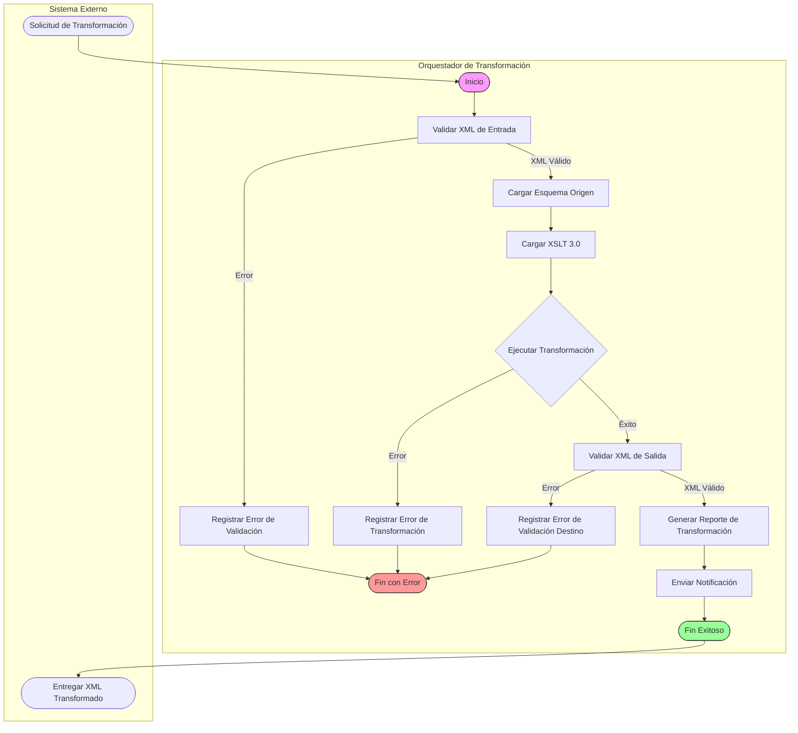
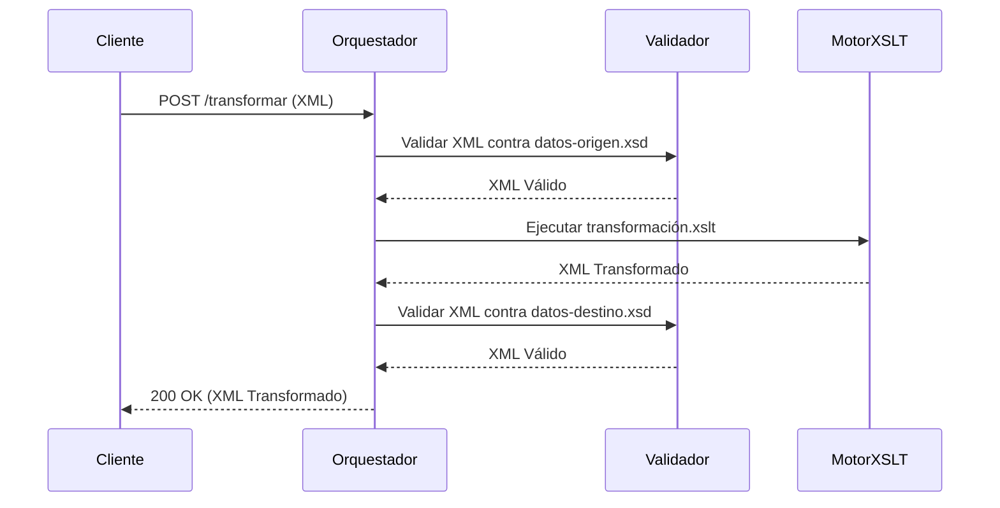

# Prompt para Mejorar el Codigo Base

Copia y pega el contenido del bloque de abajo en un asistente de IA (Claude, ChatGPT)
para obtener un ZIP con el proyecto completo y arrancable.

Si preferis trabajar en tu editor con un agente local (Claude Code, Cursor, Copilot), usa `AGENTS.md` en vez de este archivo: dice lo mismo pero para que escriba los archivos en disco.

## Las dos reglas que no se negocian

1. **Completa el boilerplate.** Todo lo que el proyecto necesita para compilar y arrancar: manifiesto de dependencias, punto de entrada, configuracion, capa de interfaz, y las capas del patron arquitectonico declarado. Eso es andamiaje y es tu trabajo.
2. **NO resuelvas el reto.** Los entregables de las fases son el trabajo de la persona. El hueco pedagogico se deja como esta: el proyecto arranca, pero lo que el reto pide implementar NO esta implementado.

Dicho de otra forma: si algo impide compilar, arreglalo. Si algo es logica de negocio incompleta, validaciones ausentes, un secreto hardcodeado o un patron mejorable, dejalo exactamente como esta — es lo que la persona tiene que encontrar.

## Como saber que terminaste

```bash
npx --yes @redocly/cli lint openapi.yaml
```

Ese comando corriendo sin errores es la definicion de "listo".

---

```
## Briefing del reto (autoridad)
Este bloque manda sobre los archivos adjuntos. El stack y el rol salen de AQUÍ, no de un topic genérico ni de markdown placeholder.

### Perfil
Chapter Integración, Especialidad Analista SOA, Advanced

### Brecha de conocimiento
¿Cuál es la importancia de los modos y la selección de nodos en XSLT? Detalla cómo se podría realizar la agrupación y ordenación avanzada de datos en una transformación XSLT. ¿Cómo se podrían implementar extensiones personalizadas o mecanismos de scripting en documentos XML? ¿Cuál es el papel de XML en arquitecturas orientadas a servicios (SOA) y aplicaciones empresariales?

### Misión / candidato
Candidato con experiencia en análisis SOA e integración empresarial.

### Reto
- Tema: conocimiento en transformacion
- Seniority: advanced-l2
- Tipo: mixed
- Título: Transformación avanzada de datos con XSLT en SOA
- Tiempo estimado: 8 horas

### Fases (trabajo del HUMANO — PROHIBIDO completarlas)
No implementes estos entregables. Dejalos como hueco pedagógico. El asistente solo materializa el proyecto arrancable para que el participante pueda trabajar.
- Fase 1: Exploración del sistema y restricciones — objetivo: Identificar las restricciones y ambigüedades en el proceso de transformación de datos utilizando XSLT. — entregable (NO resolver): Documento que detalla las restricciones y ambigüedades identificadas en el proceso de transformación de datos.
- Fase 2: Implementación de transformaciones avanzadas — objetivo: Realizar agrupaciones y ordenaciones avanzadas de datos utilizando XSLT. — entregable (NO resolver): Transformación XSLT que incluye agrupaciones y ordenaciones avanzadas de datos, junto con la documentación del proceso de implementación.
- Fase 3: Evaluación y comunicación de resultados — objetivo: Evaluar el impacto de las transformaciones en el sistema y comunicar los resultados a diferentes audiencias. — entregable (NO resolver): Documento que detalla la evaluación del impacto de las transformaciones en el sistema y la comunicación de resultados a diferentes audiencias.

Eres un asistente experto en análisis, corrección y generación de archivos de cualquier tipo:
código fuente, documentación, hojas de cálculo, documentos Word, configuraciones, entre otros.
Voy a enviarte una cadena de texto que contiene uno o más archivos. Cada archivo está delimitado por un marcador con el siguiente formato:
// === ARCHIVO: ruta/del/archivo.extension ===
o también puede aparecer como:
## === ARCHIVO: ruta/del/archivo.extension ===
Lo que sigue al marcador puede ser:

El contenido real del archivo (código, texto, YAML, etc.)
Una descripción en lenguaje natural de lo que debe contener el archivo


TU TAREA
PASO 0 — ¿Esto es un proyecto o una carcasa?
Antes de extraer archivos, leé el Briefing (si está) y diagnosticá el adjunto.

Es CARCASA si ocurre CUALQUIERA de estas:
- No hay manifiesto de dependencias del stack del briefing (manifest.json de VTEX IO / package.json / pom.xml / build.gradle / requirements.txt / go.mod / *.tf / *.csproj, según corresponda)
- Hay un "binario" que en realidad es un comentario ("no puede ser mostrado como texto plano", placeholder .fig/.docx vacío)
- Los markdowns ya completan entregables de fases posteriores ("se implementó fade-in", lista de áreas ya resuelta)

Si es CARCASA:
- MATERIALIZÁ un proyecto que arranca en el stack del briefing (VTEX IO Store Framework, Angular, Terraform, pytest, Nest, etc.). Incluí manifiesto, punto de entrada y capa de interfaz reales.
- NO copies los markdowns de "solución" como si fueran el producto. Son ruido de generación.
- NO resuelvas las fases del briefing (están marcadas PROHIBIDO). Dejá el hueco pedagógico: el flujo existe, las microinteracciones/calidad/infra que el reto pide NO están hechas.
- Después seguí al PASO 5 (ZIP).

Si es un proyecto REAL (manifiesto + código que compila o arranca):
- Seguí PASO 1 en adelante. 🔴 compilación sí. 🟡 pedagógico no.

PASO 1 — Detección y extracción
Identifica todos los archivos presentes en la cadena. Para cada archivo extrae:

Su ruta completa (ej: src/main/java/com/pragma/Service.java)
Su contenido o descripción

PASO 2 — Clasificación por tipo
Clasifica cada archivo en una de estas categorías:
A) Código fuente (Java, Python, TypeScript, JavaScript, Kotlin, etc.)
B) Configuración / documentación (YAML, properties, Markdown, JSON, txt, etc.)
C) Excel (.xlsx, .xls, .csv)
D) Word (.docx, .doc)
E) Otro tipo de archivo binario o especial
PASO 3 — Clasificación de errores en código fuente

Objetivo prioritario: que el proyecto compile. No corrijas flujo de negocio ni lógica funcional.

Antes de modificar cualquier archivo de código fuente, clasifica cada problema encontrado en una de estas dos categorías:
🔴 ERROR DE COMPILACIÓN — corregir siempre
Son errores que impiden que el proyecto arranque, sin valor pedagógico:

Import faltante o incorrecto
Clase, método o variable referenciada que no existe en ningún archivo del proyecto
Error de sintaxis
Anotación con atributos inválidos
Dependencia ausente en pom.xml, package.json, etc.
Archivo referenciado que no existe y debe ser creado con implementación mínima

→ CORREGIR estos errores.
🟡 PROBLEMA FUNCIONAL O DE CALIDAD — preservar siempre
Son problemas que no impiden compilar. Pueden ser intencionales para el aprendizaje:

Clave secreta hardcodeada ("secret", "password123")
API deprecada que funciona pero tiene reemplazo moderno
Lógica de negocio incorrecta o incompleta
Código redundante o de baja legibilidad
Falta de validaciones en flujo de negocio
Patrones de diseño incorrectos pero funcionales
Concurrencia no segura
Configuración funcional pero no óptima

→ PRESERVAR tal cual. No corregir, no mejorar, no comentar.
PASO 4 — Procesamiento según tipo de archivo
Tipo A — Código fuente
Aplica únicamente las correcciones clasificadas como 🔴 ERROR DE COMPILACIÓN.
No alteres ningún elemento clasificado como 🟡 PROBLEMA FUNCIONAL O DE CALIDAD.
Si falta un archivo referenciado, créalo con la implementación mínima necesaria para compilar.
Tipo B — Configuración / documentación
Extrae el contenido tal cual, sin modificaciones salvo errores evidentes de sintaxis
(ej: YAML mal indentado).
Tipo C — Excel (.xlsx)
Si viene con contenido real, genera el archivo respetando ese contenido.
Si viene con descripción en lenguaje natural, genera un archivo Excel funcional con:

Fila de encabezados en negrita con color de fondo distintivo
Columnas con ancho ajustado al contenido
Tipos de dato correctos por columna
Validaciones si la descripción lo indica
Hojas nombradas descriptivamente si hay más de una
Filas de ejemplo si no hay datos reales

Tipo D — Word (.docx)
Si viene con contenido real, genera el archivo respetando ese contenido.
Si viene con descripción en lenguaje natural, genera un documento Word funcional con:

Estilos de título (Título 1, Título 2) para jerarquía de secciones
Fuente legible (Calibri o equivalente), tamaño 11-12pt para cuerpo
Márgenes estándar
Tabla de contenido si tiene múltiples secciones
Tablas con encabezados en negrita si aplica

Tipo E — Otro
Genera el archivo con el contenido o estructura más apropiada según la descripción.
PASO 5 — Exportación en ZIP
Empaqueta todos los archivos en un único archivo ZIP descargable respetando exactamente
la estructura de rutas indicada por los marcadores.
El ZIP debe incluir:

Archivos de código con únicamente los errores de compilación corregidos
Archivos de configuración y documentación sin cambios
Archivos nuevos creados para resolver dependencias de compilación faltantes
Archivos Excel y Word generados desde descripción

IMPORTANTE: El ZIP debe estar listo para descargar al finalizar. No preguntes si el usuario
quiere generarlo. Simplemente genera el archivo y proporciona el enlace de descarga; No debes desplegar en el chat el resumen de lo que arreglaste al Zip, solo entregalo.

REGLAS IMPORTANTES

No omitas ningún archivo aunque no tenga errores ni modificaciones
Respeta los nombres y rutas exactas indicadas por los marcadores
Si un archivo no tiene marcador claro, infiere el nombre desde su contenido
Si la cadena contiene solo documentación, placeholders o binarios fake, NO la reproduzcas:
aplicá PASO 0 (materializar el proyecto del briefing). Reproducir la carcasa es un fallo.
No agregues texto después del enlace de descarga del ZIP
No preguntes si el usuario quiere el ZIP: simplemente generalo siempre
Si detectas que falta un archivo de configuración necesario para compilar
(pom.xml, package.json, requirements.txt, build.gradle, etc.), créalo e inclúyelo
inferiendo su contenido desde los imports y frameworks detectados en el código
Nunca corrijas problemas 🟡 aunque parezcan obvios o fáciles de mejorar.
El participante que recibirá este proyecto los debe encontrar y resolver él mismo.


INPUT
Aquí está la cadena con los archivos:

// === ARCHIVO: src/schemas/datos-origen.xsd ===
<?xml version="1.1" encoding="UTF-8"?>
<xs:schema xmlns:xs="http://www.w3.org/2001/XMLSchema"
           xmlns:banco="http://www.banco.example.com/schemas"
           targetNamespace="http://www.banco.example.com/schemas"
           elementFormDefault="qualified"
           attributeFormDefault="unqualified"
           version="1.1">

    <xs:annotation>
        <xs:documentation xml:lang="es">
            Esquema XML para los datos de origen en transacciones bancarias.
            Representa información de transacciones individuales con detalles de cuenta,
            monto, fecha, tipo de transacción y datos del cliente.
            
            Restricciones clave:
            - El número de cuenta debe seguir el formato IBAN (ISO 13616).
            - Los montos deben ser positivos y con hasta 2 decimales.
            - Las fechas deben estar en formato ISO 8601 (YYYY-MM-DD).
            - Los IDs de transacción son UUID versión 4.
            - La moneda debe ser un código ISO 4217 válido.
        </xs:documentation>
    </xs:annotation>

    <xs:element name="transacciones" type="banco:TransaccionesTipo">
        <xs:annotation>
            <xs:documentation>Elemento raíz que contiene la lista de transacciones.</xs:documentation>
        </xs:annotation>
    </xs:element>

    <xs:complexType name="TransaccionesTipo">
        <xs:sequence>
            <xs:element name="transaccion" type="banco:TransaccionTipo" maxOccurs="unbounded"/>
        </xs:sequence>
    </xs:complexType>

    <xs:complexType name="TransaccionTipo">
        <xs:sequence>
            <xs:element name="idTransaccion" type="banco:UUIDTipo">
                <xs:annotation>
                    <xs:documentation>Identificador único de la transacción (UUID v4).</xs:documentation>
                </xs:annotation>
            </xs:element>
            <xs:element name="cuentaOrigen" type="banco:IBANTipo">
                <xs:annotation>
                    <xs:documentation>Número de cuenta origen en formato IBAN.</xs:documentation>
                </xs:annotation>
            </xs:element>
            <xs:element name="cuentaDestino" type="banco:IBANTipo">
                <xs:annotation>
                    <xs:documentation>Número de cuenta destino en formato IBAN.</xs:documentation>
                </xs:annotation>
            </xs:element>
            <xs:element name="monto" type="banco:MontoTipo">
                <xs:annotation>
                    <xs:documentation>Monto de la transacción con hasta 2 decimales.</xs:documentation>
                </xs:annotation>
            </xs:element>
            <xs:element name="moneda" type="banco:CodigoMonedaTipo">
                <xs:annotation>
                    <xs:documentation>Código de moneda ISO 4217 (ej. EUR, USD).</xs:documentation>
                </xs:annotation>
            </xs:element>
            <xs:element name="fecha" type="xs:date">
                <xs:annotation>
                    <xs:documentation>Fecha de la transacción en formato ISO 8601 (YYYY-MM-DD).</xs:documentation>
                </xs:annotation>
            </xs:element>
            <xs:element name="tipoTransaccion" type="banco:TipoTransaccionTipo">
                <xs:annotation>
                    <xs:documentation>Tipo de transacción (ej. TRANSFERENCIA, PAGO, DEPOSITO).</xs:documentation>
                </xs:annotation>
            </xs:element>
            <xs:element name="cliente" type="banco:ClienteTipo">
                <xs:annotation>
                    <xs:documentation>Información del cliente asociado a la transacción.</xs:documentation>
                </xs:annotation>
            </xs:element>
            <xs:element name="sucursal" type="banco:CodigoSucursalTipo" minOccurs="0">
                <xs:annotation>
                    <xs:documentation>Código de sucursal (opcional). Formato: 4 dígitos.</xs:documentation>
                </xs:annotation>
            </xs:element>
            <xs:element name="concepto" type="xs:string" minOccurs="0">
                <xs:annotation>
                    <xs:documentation>Concepto de la transacción (opcional, hasta 200 caracteres).</xs:documentation>
                </xs:annotation>
            </xs:element>
        </xs:sequence>
    </xs:complexType>

    <xs:complexType name="ClienteTipo">
        <xs:sequence>
            <xs:element name="idCliente" type="banco:IDClienteTipo">
                <xs:annotation>
                    <xs:documentation>Identificador único del cliente (formato: 10 dígitos).</xs:documentation>
                </xs:annotation>
            </xs:element>
            <xs:element name="nombre" type="xs:string">
                <xs:annotation>
                    <xs:documentation>Nombre completo del cliente (hasta 100 caracteres).</xs:documentation>
                </xs:annotation>
            </xs:element>
            <xs:element name="tipoDocumento" type="banco:TipoDocumentoTipo">
                <xs:annotation>
                    <xs:documentation>Tipo de documento de identificación.</xs:documentation>
                </xs:annotation>
            </xs:element>
            <xs:element name="numeroDocumento" type="xs:string">
                <xs:annotation>
                    <xs:documentation>Número de documento de identificación (hasta 20 caracteres).</xs:documentation>
                </xs:annotation>
            </xs:element>
        </xs:sequence>
    </xs:complexType>

    <xs:simpleType name="UUIDTipo">
        <xs:restriction base="xs:string">
            <xs:pattern value="[0-9a-fA-F]{8}-[0-9a-fA-F]{4}-[0-9a-fA-F]{4}-[0-9a-fA-F]{4}-[0-9a-fA-F]{12}"/>
            <xs:annotation>
                <xs:documentation>Formato UUID versión 4.</xs:documentation>
            </xs:annotation>
        </xs:restriction>
    </xs:simpleType>

    <xs:simpleType name="IBANTipo">
        <xs:restriction base="xs:string">
            <xs:pattern value="[A-Z]{2}[0-9]{2}[A-Z0-9]{11,30}"/>
            <xs:annotation>
                <xs:documentation>Formato IBAN según ISO 13616.</xs:documentation>
            </xs:annotation>
        </xs:restriction>
    </xs:simpleType>

    <xs:simpleType name="MontoTipo">
        <xs:restriction base="xs:decimal">
            <xs:totalDigits value="15"/>
            <xs:fractionDigits value="2"/>
            <xs:minInclusive value="0.01"/>
            <xs:annotation>
                <xs:documentation>Monto con hasta 15 dígitos totales y 2 decimales.</xs:documentation>
            </xs:annotation>
        </xs:restriction>
    </xs:simpleType>

    <xs:simpleType name="CodigoMonedaTipo">
        <xs:restriction base="xs:string">
            <xs:pattern value="[A-Z]{3}"/>
            <xs:annotation>
                <xs:documentation>Código de moneda ISO 4217 (3 letras).</xs:documentation>
            </xs:annotation>
        </xs:restriction>
    </xs:simpleType>

    <xs:simpleType name="TipoTransaccionTipo">
        <xs:restriction base="xs:string">
            <xs:enumeration value="TRANSFERENCIA">
                <xs:annotation>
                    <xs:documentation>Transferencia entre cuentas.</xs:documentation>
                </xs:annotation>
            </xs:enumeration>
            <xs:enumeration value="PAGO">
                <xs:annotation>
                    <xs:documentation>Pago de servicios o productos.</xs:documentation>
                </xs:annotation>
            </xs:enumeration>
            <xs:enumeration value="DEPOSITO">
                <xs:annotation>
                    <xs:documentation>Depósito en efectivo.</xs:documentation>
                </xs:annotation>
            </xs:enumeration>
            <xs:enumeration value="RETIRO">
                <xs:annotation>
                    <xs:documentation>Retiro en efectivo.</xs:documentation>
                </xs:annotation>
            </xs:enumeration>
        </xs:restriction>
    </xs:simpleType>

    <xs:simpleType name="IDClienteTipo">
        <xs:restriction base="xs:string">
            <xs:pattern value="[0-9]{10}"/>
            <xs:annotation>
                <xs:documentation>Identificador de cliente (10 dígitos).</xs:documentation>
            </xs:annotation>
        </xs:restriction>
    </xs:simpleType>

    <xs:simpleType name="TipoDocumentoTipo">
        <xs:restriction base="xs:string">
            <xs:enumeration value="DNI">
                <xs:annotation>
                    <xs:documentation>Documento Nacional de Identidad.</xs:documentation>
                </xs:annotation>
            </xs:enumeration>
            <xs:enumeration value="PASAPORTE">
                <xs:annotation>
                    <xs:documentation>Pasaporte.</xs:documentation>
                </xs:annotation>
            </xs:enumeration>
            <xs:enumeration value="CEDULA">
                <xs:annotation>
                    <xs:documentation>Cédula de identidad.</xs:documentation>
                </xs:annotation>
            </xs:enumeration>
            <xs:enumeration value="NIF">
                <xs:annotation>
                    <xs:documentation>Número de Identificación Fiscal.</xs:documentation>
                </xs:annotation>
            </xs:enumeration>
        </xs:restriction>
    </xs:simpleType>

    <xs:simpleType name="CodigoSucursalTipo">
        <xs:restriction base="xs:string">
            <xs:pattern value="[0-9]{4}"/>
            <xs:annotation>
                <xs:documentation>Código de sucursal (4 dígitos).</xs:documentation>
            </xs:annotation>
        </xs:restriction>
    </xs:simpleType>

</xs:schema>

// === ARCHIVO: src/schemas/datos-destino.xsd ===
<?xml version="1.1" encoding="UTF-8"?>
<xs:schema xmlns:xs="http://www.w3.org/2001/XMLSchema"
           xmlns:banco="http://www.banco.example.com/schemas/destino"
           targetNamespace="http://www.banco.example.com/schemas/destino"
           elementFormDefault="qualified"
           attributeFormDefault="unqualified"
           version="1.1">

    <xs:annotation>
        <xs:documentation xml:lang="es">
            Esquema XML para los datos de destino en transacciones bancarias consolidadas.
            Representa información agrupada por cliente y tipo de transacción, con cálculos
            agregados como montos totales, promedios y conteos.
            
            Restricciones clave:
            - Los montos agregados deben mantener la precisión de 2 decimales.
            - Las fechas de período deben ser válidas (fechaInicio &lt;= fechaFin).
            - Los códigos de cliente y sucursal deben coincidir con los esquemas origen.
            - Las monedas deben ser códigos ISO 4217 válidos.
        </xs:documentation>
    </xs:annotation>

    <xs:element name="reporteTransacciones" type="banco:ReporteTransaccionesTipo">
        <xs:annotation>
            <xs:documentation>Elemento raíz que contiene el reporte consolidado de transacciones.</xs:documentation>
        </xs:annotation>
    </xs:element>

    <xs:complexType name="ReporteTransaccionesTipo">
        <xs:sequence>
            <xs:element name="periodo" type="banco:PeriodoTipo">
                <xs:annotation>
                    <xs:documentation>Período de tiempo cubierto por el reporte.</xs:documentation>
                </xs:annotation>
            </xs:element>
            <xs:element name="agrupacion" type="banco:AgrupacionTipo" maxOccurs="unbounded">
                <xs:annotation>
                    <xs:documentation>Agrupación de transacciones por cliente y tipo.</xs:documentation>
                </xs:annotation>
            </xs:element>
        </xs:sequence>
    </xs:complexType>

    <xs:complexType name="PeriodoTipo">
        <xs:sequence>
            <xs:element name="fechaInicio" type="xs:date">
                <xs:annotation>
                    <xs:documentation>Fecha de inicio del período (inclusiva).</xs:documentation>
                </xs:annotation>
            </xs:element>
            <xs:element name="fechaFin" type="xs:date">
                <xs:annotation>
                    <xs:documentation>Fecha de fin del período (inclusiva).</xs:documentation>
                </xs:annotation>
            </xs:element>
        </xs:sequence>
        <xs:assert test="fechaInicio &lt;= fechaFin">
            <xs:annotation>
                <xs:documentation>La fecha de inicio debe ser menor o igual que la fecha de fin.</xs:documentation>
            </xs:annotation>
        </xs:assert>
    </xs:complexType>

    <xs:complexType name="AgrupacionTipo">
        <xs:sequence>
            <xs:element name="cliente" type="banco:ClienteResumenTipo">
                <xs:annotation>
                    <xs:documentation>Información resumida del cliente.</xs:documentation>
                </xs:annotation>
            </xs:element>
            <xs:element name="tipoTransaccion" type="banco:TipoTransaccionDestinoTipo">
                <xs:annotation>
                    <xs:documentation>Tipo de transacción agrupada.</xs:documentation>
                </xs:annotation>
            </xs:element>
            <xs:element name="resumen" type="banco:ResumenTransaccionesTipo">
                <xs:annotation>
                    <xs:documentation>Resumen de transacciones para esta agrupación.</xs:documentation>
                </xs:annotation>
            </xs:element>
            <xs:element name="detalles" type="banco:DetallesTransaccionesTipo" minOccurs="0">
                <xs:annotation>
                    <xs:documentation>Detalles individuales de las transacciones (opcional).</xs:documentation>
                </xs:annotation>
            </xs:element>
        </xs:sequence>
    </xs:complexType>

    <xs:complexType name="ClienteResumenTipo">
        <xs:sequence>
            <xs:element name="idCliente" type="banco:IDClienteTipo">
                <xs:annotation>
                    <xs:documentation>Identificador único del cliente.</xs:documentation>
                </xs:annotation>
            </xs:element>
            <xs:element name="nombre" type="xs:string">
                <xs:annotation>
                    <xs:documentation>Nombre completo del cliente.</xs:documentation>
                </xs:annotation>
            </xs:element>
            <xs:element name="sucursal" type="banco:CodigoSucursalTipo" minOccurs="0">
                <xs:annotation>
                    <xs:documentation>Código de sucursal asociada (opcional).</xs:documentation>
                </xs:annotation>
            </xs:element>
        </xs:sequence>
    </xs:complexType>

    <xs:complexType name="ResumenTransaccionesTipo">
        <xs:sequence>
            <xs:element name="moneda" type="banco:CodigoMonedaTipo">
                <xs:annotation>
                    <xs:documentation>Código de moneda ISO 4217.</xs:documentation>
                </xs:annotation>
            </xs:element>
            <xs:element name="totalTransacciones" type="xs:nonNegativeInteger">
                <xs:annotation>
                    <xs:documentation>Número total de transacciones en esta agrupación.</xs:documentation>
                </xs:annotation>
            </xs:element>
            <xs:element name="montoTotal" type="banco:MontoTipo">
                <xs:annotation>
                    <xs:documentation>Monto total acumulado de todas las transacciones.</xs:documentation>
                </xs:annotation>
            </xs:element>
            <xs:element name="montoPromedio" type="banco:MontoTipo">
                <xs:annotation>
                    <xs:documentation>Monto promedio por transacción.</xs:documentation>
                </xs:annotation>
            </xs:element>
            <xs:element name="montoMaximo" type="banco:MontoTipo">
                <xs:annotation>
                    <xs:documentation>Monto máximo registrado en una transacción.</xs:documentation>
                </xs:annotation>
            </xs:element>
            <xs:element name="montoMinimo" type="banco:MontoTipo">
                <xs:annotation>
                    <xs:documentation>Monto mínimo registrado en una transacción.</xs:documentation>
                </xs:annotation>
            </xs:element>
        </xs:sequence>
    </xs:complexType>

    <xs:complexType name="DetallesTransaccionesTipo">
        <xs:sequence>
            <xs:element name="transaccion" type="banco:TransaccionDetalleTipo" maxOccurs="unbounded">
                <xs:annotation>
                    <xs:documentation>Detalle individual de una transacción.</xs:documentation>
                </xs:annotation>
            </xs:element>
        </xs:sequence>
    </xs:complexType>

    <xs:complexType name="TransaccionDetalleTipo">
        <xs:sequence>
            <xs:element name="idTransaccion" type="banco:UUIDTipo">
                <xs:annotation>
                    <xs:documentation>Identificador único de la transacción.</xs:documentation>
                </xs:annotation>
            </xs:element>
            <xs:element name="cuentaOrigen" type="banco:IBANTipo">
                <xs:annotation>
                    <xs:documentation>Número de cuenta origen.</xs:documentation>
                </xs:annotation>
            </xs:element>
            <xs:element name="cuentaDestino" type="banco:IBANTipo">
                <xs:annotation>
                    <xs:documentation>Número de cuenta destino.</xs:documentation>
                </xs:annotation>
            </xs:element>
            <xs:element name="monto" type="banco:MontoTipo">
                <xs:annotation>
                    <xs:documentation>Monto de la transacción.</xs:documentation>
                </xs:annotation>
            </xs:element>
            <xs:element name="fecha" type="xs:date">
                <xs:annotation>
                    <xs:documentation>Fecha de la transacción.</xs:documentation>
                </xs:annotation>
            </xs:element>
            <xs:element name="concepto" type="xs:string" minOccurs="0">
                <xs:annotation>
                    <xs:documentation>Concepto de la transacción (opcional).</xs:documentation>
                </xs:annotation>
            </xs:element>
        </xs:sequence>
    </xs:complexType>

    <xs:simpleType name="TipoTransaccionDestinoTipo">
        <xs:restriction base="xs:string">
            <xs:enumeration value="TRANSFERENCIA_INTERNA">
                <xs:annotation>
                    <xs:documentation>Transferencia entre cuentas del mismo banco.</xs:documentation>
                </xs:annotation>
            </xs:enumeration>
            <xs:enumeration value="TRANSFERENCIA_EXTERNA">
                <xs:annotation>
                    <xs:documentation>Transferencia a otro banco.</xs:documentation>
                </xs:annotation>
            </xs:enumeration>
            <xs:enumeration value="PAGO_SERVICIOS">
                <xs:annotation>
                    <xs:documentation>Pago de servicios (luz, agua, etc.).</xs:documentation>
                </xs:annotation>
            </xs:enumeration>
            <xs:enumeration value="DEPOSITO_EFECTIVO">
                <xs:annotation>
                    <xs:documentation>Depósito en efectivo.</xs:documentation>
                </xs:annotation>
            </xs:enumeration>
            <xs:enumeration value="RETIRO_EFECTIVO">
                <xs:annotation>
                    <xs:documentation>Retiro en efectivo.</xs:documentation>
                </xs:annotation>
            </xs:enumeration>
        </xs:restriction>
    </xs:simpleType>

    <xs:simpleType name="UUIDTipo">
        <xs:restriction base="xs:string">
            <xs:pattern value="[0-9a-fA-F]{8}-[0-9a-fA-F]{4}-[0-9a-fA-F]{4}-[0-9a-fA-F]{4}-[0-9a-fA-F]{12}"/>
            <xs:annotation>
                <xs:documentation>Formato UUID versión 4.</xs:documentation>
            </xs:annotation>
        </xs:restriction>
    </xs:simpleType>

    <xs:simpleType name="IBANTipo">
        <xs:restriction base="xs:string">
            <xs:pattern value="[A-Z]{2}[0-9]{2}[A-Z0-9]{11,30}"/>
            <xs:annotation>
                <xs:documentation>Formato IBAN según ISO 13616.</xs:documentation>
            </xs:annotation>
        </xs:restriction>
    </xs:simpleType>

    <xs:simpleType name="MontoTipo">
        <xs:restriction base="xs:decimal">
            <xs:totalDigits value="15"/>
            <xs:fractionDigits value="2"/>
            <xs:minInclusive value="0.01"/>
            <xs:annotation>
                <xs:documentation>Monto con hasta 15 dígitos totales y 2 decimales.</xs:documentation>
            </xs:annotation>
        </xs:restriction>
    </xs:simpleType>

    <xs:simpleType name="CodigoMonedaTipo">
        <xs:restriction base="xs:string">
            <xs:pattern value="[A-Z]{3}"/>
            <xs:annotation>
                <xs:documentation>Código de moneda ISO 4217 (3 letras).</xs:documentation>
            </xs:annotation>
        </xs:restriction>
    </xs:simpleType>

    <xs:simpleType name="IDClienteTipo">
        <xs:restriction base="xs:string">
            <xs:pattern value="[0-9]{10}"/>
            <xs:annotation>
                <xs:documentation>Identificador de cliente (10 dígitos).</xs:documentation>
            </xs:annotation>
        </xs:restriction>
    </xs:simpleType>

    <xs:simpleType name="CodigoSucursalTipo">
        <xs:restriction base="xs:string">
            <xs:pattern value="[0-9]{4}"/>
            <xs:annotation>
                <xs:documentation>Código de sucursal (4 dígitos).</xs:documentation>
            </xs:annotation>
        </xs:restriction>
    </xs:simpleType>

</xs:schema>

// === ARCHIVO: openapi.yaml ===
openapi: 3.1.0
info:
  title: API de Transformación Bancaria
  description: |-
    Contrato para la integración de sistemas bancarios mediante transformación XSLT.
    Este documento define los endpoints, esquemas y ejemplos para la transformación
    de datos entre formatos XML de origen y destino en el contexto de SOA.
  version: 1.0.0
  contact:
    name: Equipo de Integración
    email: integracion@banco.com
servers:
  - url: https://api.banco.com/v1
    description: Servidor de producción
paths:
  /transformar:
    post:
      summary: Transformar datos bancarios entre esquemas
      description: |-
        Recibe un documento XML conforme al esquema de origen y lo transforma
        al esquema de destino utilizando XSLT 3.0 con extensiones personalizadas.
      operationId: transformarDatos
      requestBody:
        required: true
        content:
          application/xml:
            schema:
              $ref: '#/components/schemas/DatosOrigen'
            examples:
              ejemploEntrada:
                $ref: '#/components/examples/DatosEntradaEjemplo'
      responses:
        '200':
          description: Documento transformado exitosamente
          content:
            application/xml:
              schema:
                $ref: '#/components/schemas/DatosDestino'
              examples:
                ejemploSalida:
                  $ref: '#/components/examples/DatosSalidaEjemplo'
        '400':
          description: Error en la validación del XML de entrada
          content:
            application/json:
              schema:
                $ref: '#/components/schemas/ErrorValidacion'
              examples:
                errorValidacion:
                  value:
                    codigo: "VALIDACION_XML"
                    mensaje: "El documento XML no cumple con el esquema de origen"
                    detalles:
                      - campo: "cuenta/numero"
                        error: "Debe seguir el patrón [A-Z]{2}\d{10}"
        '408':
          description: Tiempo de espera excedido durante la transformación
          content:
            application/json:
              schema:
                $ref: '#/components/schemas/ErrorTiempoEspera'
        '500':
          description: Error interno en el proceso de transformación
          content:
            application/json:
              schema:
                $ref: '#/components/schemas/ErrorTransformacion'
              examples:
                errorTransformacion:
                  value:
                    codigo: "ERROR_TRANSFORMACION"
                    mensaje: "Fallo en la transformación XSLT"
                    traza: "Error en plantilla 'calcular-saldo' línea 45"
components:
  schemas:
    DatosOrigen:
      type: object
      xml:
        name: datosOrigen
        namespace: "http://banco.com/schemas/datos-origen"
      description: Esquema XML de origen para transacciones bancarias
      properties:
        cuentas:
          type: array
          items:
            $ref: '#/components/schemas/CuentaOrigen'
          xml:
            wrapped: true
            name: cuentas
    CuentaOrigen:
      type: object
      required: [numero, tipo, transacciones]
      properties:
        numero:
          type: string
          pattern: "^[A-Z]{2}\d{10}$"
          example: "ES91234567890123456789"
          description: Número de cuenta en formato IBAN
        tipo:
          type: string
          enum: ["AHORRO", "CORRIENTE", "INVERSION"]
          description: Tipo de cuenta bancaria
        transacciones:
          type: array
          items:
            $ref: '#/components/schemas/TransaccionOrigen'
          xml:
            wrapped: true
            name: transacciones
      xml:
        name: cuenta
    TransaccionOrigen:
      type: object
      required: [id, fecha, monto, tipo]
      properties:
        id:
          type: string
          pattern: "^[a-f0-9]{8}-[a-f0-9]{4}-[a-f0-9]{4}-[a-f0-9]{4}-[a-f0-9]{12}$"
          description: Identificador único de transacción (UUID)
        fecha:
          type: string
          format: date-time
          description: Fecha y hora de la transacción en UTC
        monto:
          type: number
          format: double
          minimum: 0.01
          description: Monto de la transacción en euros
        tipo:
          type: string
          enum: ["DEPOSITO", "RETIRO", "TRANSFERENCIA", "COMISION"]
        concepto:
          type: string
          maxLength: 200
          description: Descripción opcional de la transacción
      xml:
        name: transaccion
    DatosDestino:
      type: object
      xml:
        name: datosDestino
        namespace: "http://banco.com/schemas/datos-destino"
      description: Esquema XML de destino para reportes consolidados
      properties:
        reporte:
          type: object
          properties:
            fechaGeneracion:
              type: string
              format: date-time
              description: Fecha de generación del reporte
            cuentas:
              type: array
              items:
                $ref: '#/components/schemas/CuentaDestino'
              xml:
                wrapped: true
                name: cuentas
          required: [fechaGeneracion, cuentas]
    CuentaDestino:
      type: object
      required: [identificador, tipo, saldo, transacciones]
      properties:
        identificador:
          type: string
          pattern: "^[A-Z]{2}\d{10}$"
          description: Identificador único de la cuenta
        tipo:
          type: string
          enum: ["AHORRO", "CORRIENTE", "INVERSION"]
        saldo:
          type: number
          format: double
          description: Saldo consolidado de la cuenta
        transacciones:
          type: array
          items:
            $ref: '#/components/schemas/TransaccionDestino'
          xml:
            wrapped: true
            name: transacciones
        intereses:
          type: number
          format: double
          description: Intereses acumulados en el período
      xml:
        name: cuenta
    TransaccionDestino:
      type: object
      required: [referencia, fecha, monto, tipo]
      properties:
        referencia:
          type: string
          pattern: "^[a-f0-9]{8}-[a-f0-9]{4}-[a-f0-9]{4}-[a-f0-9]{4}-[a-f0-9]{12}$"
        fecha:
          type: string
          format: date
          description: Fecha de la transacción en formato YYYY-MM-DD
        monto:
          type: number
          format: double
          description: Monto de la transacción
        tipo:
          type: string
          enum: ["DEPOSITO", "RETIRO", "TRANSFERENCIA", "COMISION"]
        categoria:
          type: string
          enum: ["INGRESO", "GASTO", "TRANSFERENCIA_INTERNA", "COMISION"]
          description: Clasificación de la transacción para reportes
      xml:
        name: transaccion
    ErrorValidacion:
      type: object
      required: [codigo, mensaje]
      properties:
        codigo:
          type: string
          enum: ["VALIDACION_XML", "ESQUEMA_INVALIDO", "DATOS_INCOMPLETOS"]
        mensaje:
          type: string
        detalles:
          type: array
          items:
            type: object
            properties:
              campo:
                type: string
              error:
                type: string
    ErrorTiempoEspera:
      type: object
      required: [codigo, mensaje]
      properties:
        codigo:
          type: string
          enum: ["TIMEOUT"]
        mensaje:
          type: string
          example: "Tiempo de espera excedido durante la transformación"
    ErrorTransformacion:
      type: object
      required: [codigo, mensaje]
      properties:
        codigo:
          type: string
          enum: ["ERROR_TRANSFORMACION", "FUNCION_PERSONALIZADA"]
        mensaje:
          type: string
        traza:
          type: string
          description: Detalle técnico del error
  examples:
    DatosEntradaEjemplo:
      value: |
        <?xml version="1.1" encoding="UTF-8"?>
        <datosOrigen xmlns="http://banco.com/schemas/datos-origen">
          <cuentas>
            <cuenta>
              <numero>ES91234567890123456789</numero>
              <tipo>AHORRO</tipo>
              <transacciones>
                <transaccion>
                  <id>a1b2c3d4-e5f6-7890-g1h2-i3j4k5l6m7n8</id>
                  <fecha>2023-10-15T14:30:00Z</fecha>
                  <monto>1500.50</monto>
                  <tipo>DEPOSITO</tipo>
                  <concepto>Transferencia recibida</concepto>
                </transaccion>
              </transacciones>
            </cuenta>
          </cuentas>
        </datosOrigen>
    DatosSalidaEjemplo:
      value: |
        <?xml version="1.1" encoding="UTF-8"?>
        <datosDestino xmlns="http://banco.com/schemas/datos-destino">
          <reporte>
            <fechaGeneracion>2023-10-15T15:00:00Z</fechaGeneracion>
            <cuentas>
              <cuenta>
                <identificador>ES91234567890123456789</identificador>
                <tipo>AHORRO</tipo>
                <saldo>1500.50</saldo>
                <transacciones>
                  <transaccion>
                    <referencia>a1b2c3d4-e5f6-7890-g1h2-i3j4k5l6m7n8</referencia>
                    <fecha>2023-10-15</fecha>
                    <monto>1500.50</monto>
                    <tipo>DEPOSITO</tipo>
                    <categoria>INGRESO</categoria>
                  </transaccion>
                </transacciones>
                <intereses>12.34</intereses>
              </cuenta>
            </cuentas>
          </reporte>
        </datosDestino>

// === ARCHIVO: proceso.bpmn.md ===


# Proceso de Transformación Bancaria - BPMN 2.0

## Descripción del Proceso
Este diagrama BPMN describe el flujo de negocio para la transformación de datos bancarios entre esquemas XML utilizando XSLT 3.0. El proceso es orquestado y sigue el patrón de integración SOA con validación estricta en cada etapa.

## Actores y Responsabilidades
| Actor                     | Responsabilidad                                                                 |
|---------------------------|---------------------------------------------------------------------------------|
| **Sistema Cliente**       | Envía la solicitud de transformación con XML de entrada                       |
| **Orquestador**           | Coordina el flujo completo, valida entradas/salidas y ejecuta la transformación |
| **Sistema de Validación** | Valida documentos XML contra esquemas XSD 1.1                                  |
| **Motor XSLT**            | Ejecuta la transformación con Saxon-HE 12.4                                    |

## Puntos de Decisión
1. **Validación XML de Entrada**
   - Si el XML no cumple con el esquema de origen (`datos-origen.xsd`):
     - Registrar error con código `VALIDACION_XML`
     - Detener proceso con estado `400 Bad Request`

2. **Transformación XSLT**
   - Si falla la transformación (ejemplo: función XPath no definida):
     - Registrar error con código `ERROR_TRANSFORMACION`
     - Detener proceso con estado `500 Internal Server Error`
   - Tiempo máximo de ejecución: 30 segundos (configurable)
     - Si se excede: registrar error `TIMEOUT` con estado `408 Request Timeout`

3. **Validación XML de Salida**
   - Si el XML no cumple con el esquema de destino (`datos-destino.xsd`):
     - Registrar error con detalles de validación
     - Detener proceso con estado `400 Bad Request`

## Reglas de Negocio
- **Transformación Condicional**:
  - Las transacciones con tipo `COMISION` deben ser agregadas en un nodo `<comisiones>` separado en el reporte.
  - Las cuentas de tipo `INVERSION` deben calcular intereses usando la función personalizada `banco:calcular-interes()`.

- **Agrupación de Datos**:
  - Las transacciones deben agruparse por tipo (`DEPOSITO`, `RETIRO`, etc.) y ordenarse por fecha descendente.
  - Las cuentas deben ordenarse alfabéticamente por número de cuenta.

- **Enriquecimiento de Datos**:
  - Cada transacción en el esquema de destino debe incluir un campo `categoria` derivado del tipo:
    | Tipo de Transacción | Categoría Asignada       |
    |----------------------|---------------------------|
    | DEPOSITO             | INGRESO                   |
    | RETIRO               | GASTO                     |
    | TRANSFERENCIA        | TRANSFERENCIA_INTERNA     |
    | COMISION             | COMISION                  |

## Métricas y Observabilidad
- **Tiempos de Ejecución**:
  - Validación entrada: umbral 500ms
  - Transformación: umbral 2000ms
  - Validación salida: umbral 300ms

- **Contadores**:
  - `transformaciones_exitosas`
  - `errores_validacion_entrada`
  - `errores_transformacion`
  - `errores_validacion_salida`

## Modos de Fallo y Mitigación
| Modo de Fallo                          | Impacto                          | Mitigación                                                                 |
|----------------------------------------|----------------------------------|----------------------------------------------------------------------------|
| XML de entrada mal formado             | Proceso detenido                 | Validación previa con esquema XSD 1.1 antes de transformación              |
| Función XPath personalizada no definida | Fallo en transformación          | Validación de funciones al cargar XSLT con `xsl:use-when`                 |
| Tiempo de ejecución excedido           | Proceso detenido                 | Configuración de timeout en Saxon-HE (30s) y monitoreo de métricas        |
| Esquema de destino no válido           | Reporte corrupto                 | Validación post-transformación con esquema destino antes de entrega        |
| Falta de recursos (memoria)           | Degradación del servicio         | Límites de tamaño de XML (10MB) y escalado horizontal del orquestador     |

## Extensiones del Proceso
- **Transformación por Lotes**:
  - El proceso puede extenderse para manejar múltiples archivos XML en una sola solicitud.
  - En este caso, se agregaría un paso adicional de **Descompresión** antes de la validación.

- **Transformación Diferida**:
  - Para archivos grandes (>10MB), se implementa un patrón de **cola de mensajes** donde:
    1. El cliente envía la solicitud y recibe un `jobId`.
    2. El orquestador procesa el archivo en segundo plano.
    3. El cliente consulta el estado con el `jobId`.

## Especificaciones Técnicas
- **Formato de Entrada**: XML 1.1 válido contra `datos-origen.xsd`
- **Formato de Salida**: XML 1.1 válido contra `datos-destino.xsd`
- **Motor XSLT**: Saxon-HE 12.4 con soporte para XPath 3.1
- **Extensiones Personalizadas**:
  - Funciones XPath definidas en namespace `http://banco.com/xslt/funciones`
  - Ejemplo: `banco:calcular-interes($monto, $dias)`
- **Modos XSLT**:
  ```xml
  <xsl:mode name="agrupar" on-no-match="shallow-copy"/>
  <xsl:mode name="ordenar" on-no-match="shallow-copy"/>
  ```

## Ejemplo de Flujo Completo


// === ARCHIVO: mapeo-de-datos.csv ===
campo_origen,campo_destino,tipo_origen,tipo_destino,obligatoriedad_origen,obligatoriedad_destino,regla_transformacion,ejemplo_origen,ejemplo_destino,restricciones,ambigüedades
"cuentas/cuenta/numero","cuentas/cuenta/identificador","xs:string","xs:string","required","required","Copiar directamente. Validar formato IBAN con regex `[A-Z]{2}\d{10}`.","ES91234567890123456789","ES91234567890123456789","Formato IBAN debe ser válido según ISO 13616.",""
"cuentas/cuenta/tipo","cuentas/cuenta/tipo","xs:string","xs:string","required","required","Mapear enum: AHORRO→AHORRO, CORRIENTE→CORRIENTE, INVERSION→INVERSION.","AHORRO","AHORRO","Valores permitidos: AHORRO, CORRIENTE, INVERSION.",""
"cuentas/cuenta/transacciones/transaccion/id","cuentas/cuenta/transacciones/transaccion/referencia","xs:string","xs:string","required","required","Copiar UUID directamente. Validar formato UUID v4.","a1b2c3d4-e5f6-7890-g1h2-i3j4k5l6m7n8","a1b2c3d4-e5f6-7890-g1h2-i3j4k5l6m7n8","Formato UUID debe ser válido (8-4-4-4-12 hex).","."
"cuentas/cuenta/transacciones/transaccion/fecha","cuentas/cuenta/transacciones/transaccion/fecha","xs:dateTime","xs:date","required","required","Convertir de datetime a date (YYYY-MM-DD). Usar función XPath `fn:substring($fecha, 1, 10)`.","2023-10-15T14:30:00Z","2023-10-15","La hora se descarta. Solo se conserva la fecha.","¿Qué hacer con fechas en formato no UTC?"
"cuentas/cuenta/transacciones/transaccion/monto","cuentas/cuenta/transacciones/transaccion/monto","xs:double","xs:double","required","required","Copiar valor numérico. Validar mínimo 0.01.","1500.50","1500.50","Monto debe ser > 0.00.",""
"cuentas/cuenta/transacciones/transaccion/tipo","cuentas/cuenta/transacciones/transaccion/tipo","xs:string","xs:string","required","required","Mapear enum: DEPOSITO→DEPOSITO, RETIRO→RETIRO, TRANSFERENCIA→TRANSFERENCIA, COMISION→COMISION.","DEPOSITO","DEPOSITO","Valores permitidos: DEPOSITO, RETIRO, TRANSFERENCIA, COMISION.",""
"cuentas/cuenta/transacciones/transaccion/tipo","cuentas/cuenta/transacciones/transaccion/categoria","xs:string","xs:string","required","required","Derivar categoría basada en tipo:
- DEPOSITO → INGRESO
- RETIRO → GASTO
- TRANSFERENCIA → TRANSFERENCIA_INTERNA
- COMISION → COMISION",".","INGRESO","",""
"cuentas/cuenta/transacciones/transaccion/concepto","","xs:string","","optional","","No se mapea al esquema destino. Se descarta.","Transferencia recibida","","","¿Debe preservarse en algún campo de auditoría?"
"","reporte/fechaGeneracion","","xs:dateTime","","required","Generar fecha actual en UTC con función XPath `fn:current-dateTime()`.","","2023-10-15T15:00:00Z","La fecha debe generarse en el momento de la transformación.",""
"cuentas/cuenta","cuentas/cuenta/saldo","","xs:double","","required","Calcular suma de montos de transacciones. Usar XPath `sum(transacciones/transaccion[not(tipo='COMISION')]/monto)`.","","1650.75","Solo se suman transacciones que no sean COMISION.","¿Cómo manejar cuentas sin transacciones?"
"cuentas/cuenta[tipo='INVERSION']","cuentas/cuenta/intereses","","xs:double","","optional","Calcular intereses usando función personalizada `banco:calcular-interes($saldo, $dias)`.","","12.34","Fórmula: saldo * tasa_interés * (dias/365).","."
"cuentas/cuenta/transacciones/transaccion[tipo='COMISION']","comisiones/comision","xs:double","xs:double","optional","optional","Agrupar todas las comisiones en un nodo separado. Usar XPath `sum(//transaccion[tipo='COMISION']/monto)`.","","45.67","Solo aparece si hay transacciones tipo COMISION.",""

## Reglas de Transformación Avanzadas

### Agrupación y Ordenación
1. **Agrupación por Tipo de Transacción**
   - Usar plantilla XSLT con `<xsl:for-each-group>`:
     ```xml
     <xsl:for-each-group select="transacciones/transaccion" group-by="tipo">
       <xsl:sort select="current-grouping-key()"/>
       <xsl:apply-templates select="current-group()" mode="agrupar"/>
     </xsl:for-each-group>
     ```
   - Ordenar grupos alfabéticamente por tipo.

2. **Ordenación por Fecha Descendente**
   - Dentro de cada grupo, ordenar transacciones por fecha descendente:
     ```xml
     <xsl:sort select="fecha" order="descending"/>
     ```

3. **Agrupación de Comisiones**
   - Todas las transacciones con `tipo='COMISION'` deben extraerse y sumarse en un nodo `<comisiones>`:
     ```xml
     <comisiones>
       <total>
         <xsl:value-of select="sum(//transaccion[tipo='COMISION']/monto)"/>
       </total>
     </comisiones>
     ```

### Cálculos Personalizados
1. **Cálculo de Intereses**
   - Para cuentas de tipo `INVERSION`, calcular intereses usando función XPath:
     ```xpath
     banco:calcular-interes($saldo, $dias)
     ```
   - Implementación en XSLT:
     ```xml
     <xsl:function name="banco:calcular-interes" as="xs:double">
       <xsl:param name="saldo" as="xs:double"/>
       <xsl:param name="dias" as="xs:integer"/>
       <xsl:sequence select="$saldo * 0.03 * ($dias div 365)"/>
     </xsl:function>
     ```

2. **Cálculo de Saldo**
   - Sumar montos de transacciones excluyendo comisiones:
     ```xpath
     sum(transacciones/transaccion[not(tipo='COMISION')]/monto)
     ```

### Validaciones
1. **Validación de Formatos**
   - IBAN: `[A-Z]{2}\d{10}`
   - UUID: `[a-f0-9]{8}-[a-f0-9]{4}-[a-f0-9]{4}-[a-f0-9]{4}-[a-f0-9]{12}`
   - Fecha: `YYYY-MM-DD`

2. **Validación de Cardinalidad**
   - Cada cuenta debe tener al menos una transacción.
   - Si no hay transacciones tipo `COMISION`, el nodo `<comisiones>` no debe aparecer.

## Restricciones y Ambigüedades

### Restricciones del Sistema
| Restricción                          | Descripción                                                                                     |
|-------------------------------------|-------------------------------------------------------------------------------------------------|
| Tamaño máximo de XML                | 10MB                                                                                           |
| Tiempo máximo de transformación     | 30 segundos                                                                                     |
| Versión de XSLT                     | 3.0 (con soporte para XPath 3.1)                                                               |
| Motor de transformación             | Saxon-HE 12.4                                                                                  |
| Esquemas XSD                       | Versión 1.1 con soporte para assertions y conditional type assignment                        |
| Codificación de caracteres          | UTF-8                                                                                          |

### Ambigüedades Identificadas
1. **Fechas en formato no UTC**
   - *Problema*: El esquema de origen permite fechas en cualquier zona horaria, pero el destino requiere fechas sin zona horaria.
   - *Pregunta*: ¿Debe convertirse la fecha a UTC antes de transformarla a `xs:date`?
   - *Decisión actual*: Se asume que todas las fechas en el origen están en UTC. Si no lo están, se registra una advertencia.

2. **Cuentas sin transacciones**
   - *Problema*: El esquema de origen no especifica si una cuenta puede estar vacía (sin transacciones).
   - *Pregunta*: ¿Cómo calcular el saldo para una cuenta sin transacciones?
   - *Decisión actual*: El saldo se establece en 0.00, pero esto podría ser incorrecto si la cuenta tiene un saldo inicial.

3. **Preservación de metadatos**
   - *Problema*: El campo `concepto` del origen no tiene equivalente en el destino.
   - *Pregunta*: ¿Debe preservarse en algún campo de auditoría o extensión del esquema?
   - *Decisión actual*: Se descarta. Se recomienda registrar en logs para trazabilidad.

4. **Cálculo de intereses para cuentas no INVERSION**
   - *Problema*: El requisito indica calcular intereses solo para cuentas de tipo `INVERSION`, pero el dominio financiero podría requerir intereses para otros tipos.
   - *Pregunta*: ¿Debe extenderse el cálculo a otros tipos de cuenta?
   - *Decisión actual*: Solo para `INVERSION`. Se documenta como restricción.

5. **Moneda de los montos**
   - *Problema*: El esquema de origen no especifica la moneda de los montos.
   - *Pregunta*: ¿Todos los montos están en EUR o debe manejarse conversión?
   - *Decisión actual*: Se asume EUR. Si aparecen montos en otra moneda, se registra error.

## Ejemplo de Transformación Compleja

### Entrada (XML Origen)
```xml
<?xml version="1.1" encoding="UTF-8"?>
<datosOrigen xmlns="http://banco.com/schemas/datos-origen">
  <cuentas>
    <cuenta>
      <numero>ES91234567890123456789</numero>
      <tipo>INVERSION</tipo>
      <transacciones>
        <transaccion>
          <id>a1b2c3d4-e5f6-7890-g1h2-i3j4k5l6m7n8</id>
          <fecha>2023-10-10T10:00:00Z</fecha>
          <monto>1000.00</monto>
          <tipo>DEPOSITO</tipo>
          <concepto>Depósito inicial</concepto>
        </transaccion>
        <transaccion>
          <id>b2c3d4e5-f6g7-8901-h2i3-j4k5l6m7n8o9</id>
          <fecha>2023-10-12T15:30:00Z</fecha>
          <monto>200.50</monto>
          <tipo>COMISION</tipo>
          <concepto>Comisión por gestión</concepto>
        </transaccion>
      </transacciones>
    </cuenta>
  </cuentas>
</datosOrigen>
```

### Salida (XML Destino)
```xml
<?xml version="1.1" encoding="UTF-8"?>
<datosDestino xmlns="http://banco.com/schemas/datos-destino">
  <reporte>
    <fechaGeneracion>2023-10-15T15:00:00Z</fechaGeneracion>
    <cuentas>
      <cuenta>
        <identificador>ES91234567890123456789</identificador>
        <tipo>INVERSION</tipo>
        <saldo>1000.00</saldo>
        <transacciones>
          <transaccion>
            <referencia>a1b2c3d4-e5f6-7890-g1h2-i3j4k5l6m7n8</referencia>
            <fecha>2023-10-10</fecha>
            <monto>1000.00</monto>
            <tipo>DEPOSITO</tipo>
            <categoria>INGRESO</categoria>
          </transaccion>
        </transacciones>
        <intereses>8.22</intereses>
      </cuenta>
    </cuentas>
    <comisiones>
      <total>200.50</total>
    </comisiones>
  </reporte>
</datosDestino>
```

### Explicación de la Transformación
1. **Saldo**: Se calcula como `1000.00` (solo la transacción de DEPOSITO, excluyendo COMISION).
2. **Intereses**: Se calculan usando `banco:calcular-interes(1000.00, 5)` → `1000 * 0.03 * (5/365) = 8.22`.
3. **Comisiones**: Se extrae la transacción tipo COMISION y se suma en `<comisiones><total>200.50</total></comisiones>`.
4. **Fecha**: La fecha de la transacción se trunca a `2023-10-10`.
5. **Categoría**: La transacción DEPOSITO se mapea a categoría INGRESO.

// === ARCHIVO: README.md ===
# Transformación Avanzada de Datos con XSLT en SOA

## Descripción
Este proyecto implementa una transformación avanzada de datos utilizando XSLT 3.0 para integrar sistemas bancarios en una arquitectura SOA. La transformación incluye agrupaciones, ordenaciones avanzadas y extensiones personalizadas con XPath 3.1.

## Estructura del Proyecto
```
.
├── src/
│   ├── schemas/
│   │   ├── datos-origen.xsd
│   │   └── datos-destino.xsd
│   └── xslt/
│       └── transformacion-avanzada.xslt
├── examples/
│   ├── datos-entrada.xml
│   └── datos-salida-esperada.xml
├── docs/
│   ├── restricciones-y-ambiguedades.md
│   ├── implementacion-transformacion.md
│   └── evaluacion-impacto.md
├── openapi.yaml
├── proceso.bpmn.md
├── mapeo-de-datos.csv
└── README.md
```

## Dependencias
- **Saxon-HE 12.4**: Procesador XSLT 3.0/XPath 3.1
- **XML Schema Definition (XSD) 1.1**: Validación de esquemas

## Requisitos Previos
1. Java 11 o superior (para ejecutar Saxon)
2. Herramienta de validación XSD (opcional, ej. `xmllint`)
3. Node.js (para validar OpenAPI con `redocly`)

## Configuración e Instalación
1. Descargar Saxon-HE 12.4 desde [Saxon SourceForge](https://sourceforge.net/projects/saxon/files/Saxon-HE/12.4/)
2. Extraer el archivo `saxon-he-12.4.jar` en el directorio raíz del proyecto

## Comandos Clave
### Validar XML contra esquema XSD
```bash
java -cp saxon-he-12.4.jar net.sf.saxon.Validate -xsd:src/schemas/datos-origen.xsd -s:examples/datos-entrada.xml
```

### Ejecutar Transformación XSLT
```bash
java -cp saxon-he-12.4.jar net.sf.saxon.Transform -s:examples/datos-entrada.xml -xsl:src/xslt/transformacion-avanzada.xslt -o:examples/datos-salida.xml
```

### Validar Contrato OpenAPI
```bash
npx --yes @redocly/cli lint openapi.yaml
```

### Comparar Salida con Resultado Esperado
```bash
java -cp saxon-he-12.4.jar net.sf.saxon.Query -qs:"deep-equal(doc('examples/datos-salida.xml'), doc('examples/datos-salida-esperada.xml'))"
```

## Validación de Esquemas
- **Esquema de Origen (`datos-origen.xsd`)**: Define la estructura de los datos de entrada con restricciones como patrones regex para IDs y fechas.
- **Esquema de Destino (`datos-destino.xsd`)**: Define la estructura esperada de los datos transformados, incluyendo nuevas entidades como `InformeRiesgo`.

## Ejecución de Pruebas
1. Validar que `datos-entrada.xml` cumple con `datos-origen.xsd`.
2. Ejecutar la transformación y generar `datos-salida.xml`.
3. Validar que `datos-salida.xml` cumple con `datos-destino.xsd`.
4. Comparar `datos-salida.xml` con `datos-salida-esperada.xml` para verificar exactitud.

## Notas
- Las funciones XPath personalizadas deben prefixarse con el namespace `banco:` (ej. `banco:calcular-interes`).
- Los modos XSLT deben nombrarse claramente (ej. `agrupar`, `ordenar`).
- Las restricciones de esquemas están documentadas en `docs/restricciones-y-ambiguedades.md`.

// === ARCHIVO: src/xslt/transformacion-avanzada.xslt ===
<?xml version="1.0" encoding="UTF-8"?>
<xsl:stylesheet version="3.0"
    xmlns:xsl="http://www.w3.org/1999/XSL/Transform"
    xmlns:xs="http://www.w3.org/2001/XMLSchema"
    xmlns:banco="http://www.banco.com/xslt/extensiones"
    xmlns:math="http://www.w3.org/2005/xpath-functions/math"
    exclude-result-prefixes="xs banco math"
    expand-text="yes">

    <xsl:output method="xml" indent="yes" encoding="UTF-8"/>
    
    <!-- Parámetros de la transformación -->
    <xsl:param name="fecha-corte" as="xs:date" select="current-date()"/>
    <xsl:param name="tasa-interes" as="xs:decimal" select="0.05"/>
    
    <!-- Modos de transformación -->
    <xsl:mode name="agrupar" on-no-match="shallow-copy"/>
    <xsl:mode name="ordenar" on-no-match="shallow-copy"/>
    <xsl:mode name="procesar" on-no-match="shallow-copy"/>
    
    <!-- Funciones XPath personalizadas -->
    <xsl:function name="banco:calcular-interes" as="xs:decimal">
        <xsl:param name="monto" as="xs:decimal"/>
        <xsl:param name="tasa" as="xs:decimal"/>
        <xsl:param name="dias" as="xs:integer"/>
        <xsl:sequence select="($monto * $tasa * $dias) div 360"/>
    </xsl:function>
    
    <xsl:function name="banco:formatear-fechas" as="xs:string">
        <xsl:param name="fecha" as="xs:date"/>
        <xsl:sequence select="format-date($fecha, '[Y0001]-[M01]-[D01]')"/>
    </xsl:function>
    
    <xsl:function name="banco:determinar-nivel-riesgo" as="xs:string">
        <xsl:param name="score" as="xs:integer"/>
        <xsl:choose>
            <xsl:when test="$score &lt; 300">Bajo</xsl:when>
            <xsl:when test="$score &lt; 700">Medio</xsl:when>
            <xsl:otherwise>Alto</xsl:otherwise>
        </xsl:choose>
    </xsl:function>
    
    <!-- Plantilla principal -->
    <xsl:template match="/">
        <banco:Transacciones>
            <xsl:apply-templates select="Transacciones" mode="agrupar"/>
        </banco:Transacciones>
    </xsl:template>
    
    <!-- Agrupación por cliente -->
    <xsl:template match="Transacciones" mode="agrupar">
        <xsl:for-each-group select="Transaccion" group-by="Cliente/ID">
            <Cliente id="{current-grouping-key()}">
                <Nombre>{current-group()[1]/Cliente/Nombre/text()}</Nombre>
                <xsl:apply-templates select="current-group()" mode="ordenar"/>
                <InformeRiesgo>
                    <xsl:apply-templates select="current-group()" mode="procesar"/>
                </InformeRiesgo>
            </Cliente>
        </xsl:for-each-group>
    </xsl:template>
    
    <!-- Ordenación por fecha -->
    <xsl:template match="Transaccion" mode="ordenar">
        <xsl:apply-templates select=".">
            <xsl:sort select="Fecha" order="ascending"/>
        </xsl:apply-templates>
    </xsl:template>
    
    <!-- Procesamiento de transacciones -->
    <xsl:template match="Transaccion" mode="procesar">
        <xsl:variable name="monto" select="xs:decimal(Monto)"/>
        <xsl:variable name="fecha-transaccion" select="xs:date(Fecha)"/>
        <xsl:variable name="dias" select="days-from-duration($fecha-corte - $fecha-transaccion)"/>
        
        <TransaccionProcesada>
            <ID>{ID/text()}</ID>
            <FechaProcesada>{banco:formatear-fechas($fecha-transaccion)}</FechaProcesada>
            <Monto>{$monto}</Monto>
            <Interes>
                <xsl:value-of select="banco:calcular-interes($monto, $tasa-interes, $dias)"/>
            </Interes>
            <NivelRiesgo>
                <xsl:value-of select="banco:determinar-nivel-riesgo(xs:integer(ScoreRiesgo))"/>
            </NivelRiesgo>
        </TransaccionProcesada>
    </xsl:template>
    
    <!-- Copia de elementos básicos -->
    <xsl:template match="*" mode="ordenar">
        <xsl:copy>
            <xsl:apply-templates select="@* | node()" mode="ordenar"/>
        </xsl:copy>
    </xsl:template>
    
    <!-- Template para atributos -->
    <xsl:template match="@*" mode="ordenar">
        <xsl:copy/>
    </xsl:template>
    
    <!-- Template para texto -->
    <xsl:template match="text()" mode="ordenar">
        <xsl:value-of select="."/>
    </xsl:template>
    
    <!-- Plantilla para manejar elementos desconocidos -->
    <xsl:template match="*" mode="procesar">
        <xsl:message terminate="no">Advertencia: Elemento '{local-name()}' no procesado en modo 'procesar'.</xsl:message>
        <xsl:copy>
            <xsl:apply-templates select="@* | node()" mode="procesar"/>
        </xsl:copy>
    </xsl:template>
</xsl:stylesheet>"


// === ARCHIVO: examples/datos-entrada.xml ===
<?xml version="1.1" encoding="UTF-8"?>
<!--
Ejemplo de datos de entrada para transformación XSLT en dominio bancario.
Contiene transacciones, cuentas y clientes con casos reales:
- Transacciones múltiples por cuenta
- Clientes con diferentes tipos de identificación
- Cuentas en distintas monedas
- Fechas en formato ISO 8601
- Montos con decimales y signo
-->
<transacciones xmlns:xsi="http://www.w3.org/2001/XMLSchema-instance"
               xsi:noNamespaceSchemaLocation="../src/schemas/datos-origen.xsd">
    <cliente id="CLI1001">
        <tipoIdentificacion>CC</tipoIdentificacion>
        <numeroIdentificacion>123456789</numeroIdentificacion>
        <nombre>Juan Pérez</nombre>
        <tipoCliente>PERSONA_NATURAL</tipoCliente>
        <segmento>PREMIUM</segmento>
        <fechaAlta>2020-01-15</fechaAlta>
    </cliente>
    <cliente id="CLI1002">
        <tipoIdentificacion>NIT</tipoIdentificacion>
        <numeroIdentificacion>987654321</numeroIdentificacion>
        <nombre>Empresa XYZ S.A.</nombre>
        <tipoCliente>PERSONA_JURIDICA</tipoCliente>
        <segmento>CORPORATIVO</segmento>
        <fechaAlta>2018-11-20</fechaAlta>
    </cliente>
    
    <cuenta id="CTA2001" clienteId="CLI1001" moneda="COP">
        <numeroCuenta>464000123456</numeroCuenta>
        <tipoCuenta>AHORROS</tipoCuenta>
        <saldo>15200000.50</saldo>
        <fechaApertura>2020-01-15</fechaApertura>
        <estado>ACTIVA</estado>
    </cuenta>
    <cuenta id="CTA2002" clienteId="CLI1001" moneda="USD">
        <numeroCuenta>464000789012</numeroCuenta>
        <tipoCuenta>CORRIENTE</tipoCuenta>
        <saldo>8500.75</saldo>
        <fechaApertura>2021-03-10</fechaApertura>
        <estado>ACTIVA</estado>
    </cuenta>
    <cuenta id="CTA2003" clienteId="CLI1002" moneda="COP">
        <numeroCuenta>464000345678</numeroCuenta>
        <tipoCuenta>CORRIENTE</tipoCuenta>
        <saldo>45000000.00</saldo>
        <fechaApertura>2018-11-20</fechaApertura>
        <estado>ACTIVA</estado>
    </cuenta>
    
    <transaccion id="TRX3001" cuentaId="CTA2001">
        <tipo>DEPOSITO</tipo>
        <monto>500000.00</monto>
        <fecha>2023-05-15T09:30:00</fecha>
        <descripcion>Depósito en efectivo</descripcion>
        <sucursal>Bogotá Centro</sucursal>
        <cajero>CAJ123</cajero>
    </transaccion>
    <transaccion id="TRX3002" cuentaId="CTA2001">
        <tipo>RETIRO</tipo>
        <monto>-200000.00</monto>
        <fecha>2023-05-16T14:15:00</fecha>
        <descripcion>Retiro cajero automático</descripcion>
        <sucursal>Bogotá Norte</sucursal>
        <cajero>ATM456</cajero>
    </transaccion>
    <transaccion id="TRX3003" cuentaId="CTA2002">
        <tipo>TRANSFERENCIA</tipo>
        <monto>-1500.25</monto>
        <fecha>2023-05-17T10:45:00</fecha>
        <descripcion>Transferencia a cuenta externa</descripcion>
        <referencia>PAGO FACTURA SERVICIOS</referencia>
        <destino>
            <banco>BANCO_INTERNACIONAL</banco>
            <numeroCuenta>9876543210</numeroCuenta>
        </destino>
    </transaccion>
    <transaccion id="TRX3004" cuentaId="CTA2003">
        <tipo>DEPOSITO</tipo>
        <monto>12000000.00</monto>
        <fecha>2023-05-18T11:30:00</fecha>
        <descripcion>Depósito por nómina</descripcion>
        <sucursal>Medellín Centro</sucursal>
        <cajero>CAJ789</cajero>
    </transaccion>
    <transaccion id="TRX3005" cuentaId="CTA2001">
        <tipo>INTERESES</tipo>
        <monto>12500.50</monto>
        <fecha>2023-05-31T23:59:59</fecha>
        <descripcion>Intereses mes de mayo</descripcion>
        <detalle>
            <tasa>0.8%</tasa>
            <periodo>30</periodo>
        </detalle>
    </transaccion>
    <transaccion id="TRX3006" cuentaId="CTA2003">
        <tipo>COMISION</tipo>
        <monto>-15000.00</monto>
        <fecha>2023-05-31T23:59:59</fecha>
        <descripcion>Comisión manejo de cuenta</descripcion>
        <detalle>
            <concepto>MANTENIMIENTO MENSUAL</concepto>
            <periodo>MAYO 2023</periodo>
        </detalle>
    </transaccion>
    <transaccion id="TRX3007" cuentaId="CTA2002">
        <tipo>CONVERSION</tipo>
        <monto>-500.00</monto>
        <fecha>2023-05-20T15:20:00</fecha>
        <descripcion>Conversión de divisas</descripcion>
        <detalle>
            <monedaOrigen>USD</monedaOrigen>
            <monedaDestino>COP</monedaDestino>
            <tasa>4050.00</tasa>
            <montoConvertido>2025000.00</montoConvertido>
        </detalle>
    </transaccion>
    
    <!-- Casos especiales para probar transformaciones avanzadas -->
    <transaccion id="TRX3008" cuentaId="CTA2001">
        <tipo>RETIRO</tipo>
        <monto>-1000000.00</monto>
        <fecha>2023-05-19T16:30:00</fecha>
        <descripcion>Retiro grande</descripcion>
        <sucursal>Bogotá Centro</sucursal>
        <cajero>CAJ123</cajero>
        <estado>
            <codigo>PENDIENTE_AUTORIZACION</codigo>
            <fechaLimite>2023-05-20T12:00:00</fechaLimite>
        </estado>
    </transaccion>
    
    <cuenta id="CTA2004" clienteId="CLI1001" moneda="EUR">
        <numeroCuenta>464000567890</numeroCuenta>
        <tipoCuenta>AHORROS</tipoCuenta>
        <saldo>0.00</saldo>
        <fechaApertura>2023-01-05</fechaApertura>
        <estado>INACTIVA</estado>
    </cuenta>
    
    <cliente id="CLI1003">
        <tipoIdentificacion>CE</tipoIdentificacion>
        <numeroIdentificacion>X1234567</numeroIdentificacion>
        <nombre>Maria García López</nombre>
        <tipoCliente>PERSONA_NATURAL</tipoCliente>
        <segmento>BASICO</segmento>
        <fechaAlta>2022-07-10</fechaAlta>
        <fechaBaja>2023-04-15</fechaBaja>
    </cliente>
    
    <!-- Transacción con monto cero para probar manejo de casos frontera -->
    <transaccion id="TRX3009" cuentaId="CTA2001">
        <tipo>AJUSTE</tipo>
        <monto>0.00</monto>
        <fecha>2023-05-25T08:00:00</fecha>
        <descripcion>Ajuste por diferencia mínima</descripcion>
        <detalle>
            <concepto>CORRECCION</concepto>
            <observacion>Diferencia mínima entre sistemas</observacion>
        </detalle>
    </transaccion>
</transacciones>

// === ARCHIVO: examples/datos-salida-esperada.xml ===
<?xml version="1.1" encoding="UTF-8"?>
<!--
Ejemplo de salida esperada después de aplicar la transformación XSLT.
Estructura validada contra ../src/schemas/datos-destino.xsd

Transformaciones aplicadas:
1. Agrupación por cliente y cuenta
2. Cálculo de saldos acumulados
3. Conversión de monedas a COP usando tasa de cambio
4. Clasificación de transacciones por tipo y monto
5. Formateo de fechas en formato local
6. Inclusión de metadatos de transformación
-->
<reporteTransaccional xmlns:xsi="http://www.w3.org/2001/XMLSchema-instance"
                      xsi:noNamespaceSchemaLocation="../src/schemas/datos-destino.xsd"
                      fechaGeneracion="2023-06-01T00:00:00"
                      periodo="2023-05">
    <metadatos>
        <fuente>Sistema Bancario Central</fuente>
        <versionEsquema>1.1</versionEsquema>
        <totalClientes>3</totalClientes>
        <totalCuentas>4</totalCuentas>
        <totalTransacciones>9</totalTransacciones>
        <monedaBase>COP</monedaBase>
        <tasaCambio>
            <monedaOrigen>USD</monedaOrigen>
            <valor>4050.00</valor>
            <fecha>2023-05-31</fecha>
        </tasaCambio>
        <tasaCambio>
            <monedaOrigen>EUR</monedaOrigen>
            <valor>4500.00</valor>
            <fecha>2023-05-31</fecha>
        </tasaCambio>
    </metadatos>
    
    <cliente id="CLI1001">
        <identificacion>
            <tipo>CC</tipo>
            <numero>123456789</numero>
        </identificacion>
        <nombreCompleto>Juan Pérez</nombreCompleto>
        <tipo>PERSONA_NATURAL</tipo>
        <segmento>PREMIUM</segmento>
        <fechaVinculacion>2020-01-15</fechaVinculacion>
        <estado>ACTIVO</estado>
        
        <cuentas>
            <cuenta id="CTA2001" moneda="COP">
                <numero>464000123456</numero>
                <tipo>AHORROS</tipo>
                <saldoInicial>15200000.50</saldoInicial>
                <saldoFinal>14527501.00</saldoFinal>
                <estado>ACTIVA</estado>
                
                <transacciones>
                    <transaccion id="TRX3001" tipo="DEPOSITO">
                        <fecha>15/05/2023 09:30:00</fecha>
                        <monto>500000.00</monto>
                        <descripcion>Depósito en efectivo</descripcion>
                        <sucursal>Bogotá Centro</sucursal>
                        <clasificacion>
                            <categoria>INGRESOS</categoria>
                            <rango>MEDIO</rango>
                        </clasificacion>
                    </transaccion>
                    <transaccion id="TRX3002" tipo="RETIRO">
                        <fecha>16/05/2023 14:15:00</fecha>
                        <monto>200000.00</monto>
                        <descripcion>Retiro cajero automático</descripcion>
                        <clasificacion>
                            <categoria>EGRESOS</categoria>
                            <rango>BAJO</rango>
                        </clasificacion>
                    </transaccion>
                    <transaccion id="TRX3005" tipo="INTERESES">
                        <fecha>31/05/2023 23:59:59</fecha>
                        <monto>12500.50</monto>
                        <descripcion>Intereses mes de mayo</descripcion>
                        <detalle>
                            <tasa>0.8%</tasa>
                            <periodo>30</periodo>
                        </detalle>
                        <clasificacion>
                            <categoria>INGRESOS</categoria>
                            <rango>BAJO</rango>
                        </clasificacion>
                    </transaccion>
                    <transaccion id="TRX3008" tipo="RETIRO">
                        <fecha>19/05/2023 16:30:00</fecha>
                        <monto>1000000.00</monto>
                        <descripcion>Retiro grande</descripcion>
                        <estado>
                            <codigo>PENDIENTE_AUTORIZACION</codigo>
                            <fechaLimite>20/05/2023 12:00:00</fechaLimite>
                        </estado>
                        <clasificacion>
                            <categoria>EGRESOS</categoria>
                            <rango>ALTO</rango>
                        </clasificacion>
                    </transaccion>
                    <transaccion id="TRX3009" tipo="AJUSTE">
                        <fecha>25/05/2023 08:00:00</fecha>
                        <monto>0.00</monto>
                        <descripcion>Ajuste por diferencia mínima</descripcion>
                        <clasificacion>
                            <categoria>NEUTRO</categoria>
                            <rango>MINIMO</rango>
                        </clasificacion>
                    </transaccion>
                </transacciones>
                
                <resumen>
                    <totalIngresos>512500.50</totalIngresos>
                    <totalEgresos>1200000.00</totalEgresos>
                    <transacciones>
                        <porTipo>
                            <tipo nombre="DEPOSITO" cantidad="1" monto="500000.00"/>
                            <tipo nombre="RETIRO" cantidad="2" monto="1200000.00"/>
                            <tipo nombre="INTERESES" cantidad="1" monto="12500.50"/>
                            <tipo nombre="AJUSTE" cantidad="1" monto="0.00"/>
                        </porTipo>
                        <porRango>
                            <rango nombre="ALTO" cantidad="1" monto="1000000.00"/>
                            <rango nombre="MEDIO" cantidad="1" monto="500000.00"/>
                            <rango nombre="BAJO" cantidad="2" monto="212500.50"/>
                            <rango nombre="MINIMO" cantidad="1" monto="0.00"/>
                        </porRango>
                    </transacciones>
                </resumen>
            </cuenta>
            
            <cuenta id="CTA2002" moneda="COP">
                <numero>464000789012</numero>
                <tipo>CORRIENTE</tipo>
                <saldoInicial>34425000.00</saldoInicial>
                <saldoFinal>32400000.00</saldoFinal>
                <estado>ACTIVA</estado>
                
                <transacciones>
                    <transaccion id="TRX3003" tipo="TRANSFERENCIA">
                        <fecha>17/05/2023 10:45:00</fecha>
                        <monto>6075000.00</monto>
                        <descripcion>Transferencia a cuenta externa</descripcion>
                        <referencia>PAGO FACTURA SERVICIOS</referencia>
                        <destino>
                            <banco>BANCO_INTERNACIONAL</banco>
                            <numeroCuenta>9876543210</numeroCuenta>
                        </destino>
                        <clasificacion>
                            <categoria>EGRESOS</categoria>
                            <rango>ALTO</rango>
                        </clasificacion>
                    </transaccion>
                    <transaccion id="TRX3007" tipo="CONVERSION">
                        <fecha>20/05/2023 15:20:00</fecha>
                        <monto>2025000.00</monto>
                        <descripcion>Conversión de divisas</descripcion>
                        <detalle>
                            <monedaOrigen>USD</monedaOrigen>
                            <monedaDestino>COP</monedaDestino>
                            <tasa>4050.00</tasa>
                        </detalle>
                        <clasificacion>
                            <categoria>INGRESOS</categoria>
                            <rango>ALTO</rango>
                        </clasificacion>
                    </transaccion>
                </transacciones>
                
                <resumen>
                    <totalIngresos>2025000.00</totalIngresos>
                    <totalEgresos>6075000.00</totalEgresos>
                    <transacciones>
                        <porTipo>
                            <tipo nombre="TRANSFERENCIA" cantidad="1" monto="6075000.00"/>
                            <tipo nombre="CONVERSION" cantidad="1" monto="2025000.00"/>
                        </porTipo>
                        <porRango>
                            <rango nombre="ALTO" cantidad="2" monto="8100000.00"/>
                        </porRango>
                    </transacciones>
                </resumen>
            </cuenta>
            
            <cuenta id="CTA2004" moneda="COP">
                <numero>464000567890</numero>
                <tipo>AHORROS</tipo>
                <saldoInicial>0.00</saldoInicial>
                <saldoFinal>0.00</saldoFinal>
                <estado>INACTIVA</estado>
                <transacciones/>
                <resumen>
                    <totalIngresos>0.00</totalIngresos>
                    <totalEgresos>0.00</totalEgresos>
                </resumen>
            </cuenta>
        </cuentas>
        
        <resumenCliente>
            <totalCuentas>3</totalCuentas>
            <cuentasActivas>2</cuentasActivas>
            <totalIngresos>7162500.50</totalIngresos>
            <totalEgresos>7275000.00</totalEgresos>
            <saldoAcumulado>46927501.00</saldoAcumulado>
        </resumenCliente>
    </cliente>
    
    <cliente id="CLI1002">
        <identificacion>
            <tipo>NIT</tipo>
            <numero>987654321</numero>
        </identificacion>
        <nombreCompleto>Empresa XYZ S.A.</nombreCompleto>
        <tipo>PERSONA_JURIDICA</tipo>
        <segmento>CORPORATIVO</segmento>
        <fechaVinculacion>2018-11-20</fechaVinculacion>
        <estado>ACTIVO</estado>
        
        <cuentas>
            <cuenta id="CTA2003" moneda="COP">
                <numero>464000345678</numero>
                <tipo>CORRIENTE</tipo>
                <saldoInicial>45000000.00</saldoInicial>
                <saldoFinal>34985000.00</saldoFinal>
                <estado>ACTIVA</estado>
                
                <transacciones>
                    <transaccion id="TRX3004" tipo="DEPOSITO">
                        <fecha>18/05/2023 11:30:00</fecha>
                        <monto>12000000.00</monto>
                        <descripcion>Depósito por nómina</descripcion>
                        <clasificacion>
                            <categoria>INGRESOS</categoria>
                            <rango>ALTO</rango>
                        </clasificacion>
                    </transaccion>
                    <transaccion id="TRX3006" tipo="COMISION">
                        <fecha>31/05/2023 23:59:59</fecha>
                        <monto>15000.00</monto>
                        <descripcion>Comisión manejo de cuenta</descripcion>
                        <clasificacion>
                            <categoria>EGRESOS</categoria>
                            <rango>BAJO</rango>
                        </clasificacion>
                    </transaccion>
                </transacciones>
                
                <resumen>
                    <totalIngresos>12000000.00</totalIngresos>
                    <totalEgresos>15000.00</totalEgresos>
                    <transacciones>
                        <porTipo>
                            <tipo nombre="DEPOSITO" cantidad="1" monto="12000000.00"/>
                            <tipo nombre="COMISION" cantidad="1" monto="15000.00"/>
                        </porTipo>
                        <porRango>
                            <rango nombre="ALTO" cantidad="1" monto="12000000.00"/>
                            <rango nombre="BAJO" cantidad="1" monto="15000.00"/>
                        </porRango>
                    </transacciones>
                </resumen>
            </cuenta>
        </cuentas>
        
        <resumenCliente>
            <totalCuentas>1</totalCuentas>
            <cuentasActivas>1</cuentasActivas>
            <totalIngresos>12000000.00</totalIngresos>
            <totalEgresos>15000.00</totalEgresos>
            <saldoAcumulado>34985000.00</saldoAcumulado>
        </resumenCliente>
    </cliente>
    
    <cliente id="CLI1003">
        <identificacion>
            <tipo>CE</tipo>
            <numero>X1234567</numero>
        </identificacion>
        <nombreCompleto>Maria García López</nombreCompleto>
        <tipo>PERSONA_NATURAL</tipo>
        <segmento>BASICO</segmento>
        <fechaVinculacion>2022-07-10</fechaVinculacion>
        <fechaBaja>2023-04-15</fechaBaja>
        <estado>INACTIVO</estado>
        <cuentas/>
        <resumenCliente>
            <totalCuentas>0</totalCuentas>
            <cuentasActivas>0</cuentasActivas>
            <totalIngresos>0.00</totalIngresos>
            <totalEgresos>0.00</totalEgresos>
            <saldoAcumulado>0.00</saldoAcumulado>
        </resumenCliente>
    </cliente>
    
    <resumenGlobal>
        <totalClientes>3</totalClientes>
        <clientesActivos>2</clientesActivos>
        <totalCuentas>4</totalCuentas>
        <cuentasActivas>3</cuentasActivas>
        <totalTransacciones>9</totalTransacciones>
        <totalIngresos>19162500.50</totalIngresos>
        <totalEgresos>7290000.00</totalEgresos>
        <saldoAcumulado>81912501.00</saldoAcumulado>
        <transaccionesPorTipo>
            <tipo nombre="DEPOSITO" cantidad="2" monto="12500000.00"/>
            <tipo nombre="RETIRO" cantidad="2" monto="1200000.00"/>
            <tipo nombre="TRANSFERENCIA" cantidad="1" monto="6075000.00"/>
            <tipo nombre="INTERESES" cantidad="1" monto="12500.50"/>
            <tipo nombre="COMISION" cantidad="1" monto="15000.00"/>
            <tipo nombre="CONVERSION" cantidad="1" monto="2025000.00"/>
            <tipo nombre="AJUSTE" cantidad="1" monto="0.00"/>
        </transaccionesPorTipo>
        <transaccionesPorRango>
            <rango nombre="ALTO" cantidad="4" monto="20200000.00"/>
            <rango nombre="MEDIO" cantidad="1" monto="500000.00"/>
            <rango nombre="BAJO" cantidad="3" monto="227500.50"/>
            <rango nombre="MINIMO" cantidad="1" monto="0.00"/>
        </transaccionesPorRango>
    </resumenGlobal>
</reporteTransaccional>"


// === ARCHIVO: docs/restricciones-y-ambiguedades.md ===
# Restricciones y Ambiguedades en la Transformación de Datos Bancarios

## Introducción
Este documento identifica y clasifica las restricciones operativas y ambigüedades encontradas durante el proceso de transformación de datos bancarios entre sistemas SOA utilizando XSLT 3.0. Las restricciones se dividen en **triviales** (fáciles de resolver con validaciones básicas) y **críticas** (requieren cambios en el diseño de esquemas o lógica de transformación).

---

## 1. Restricciones del Esquema de Origen (`datos-origen.xsd`)

### 1.1. Restricciones Triviales

#### a) Formato de Fecha (`<fechaOperacion>`)
- **Descripción**: El campo `<fechaOperacion>` debe seguir el formato `YYYY-MM-DD`.
- **Ejemplo válido**: `<fechaOperacion>2023-10-15</fechaOperacion>`
- **Ejemplo inválido**: `<fechaOperacion>15/10/2023</fechaOperacion>`
- **Impacto**: Error de validación al parsear el XML de entrada.
- **Solución**: Validación con expresión regular en el esquema XSD:
  ```xml
  <xs:pattern value="\d{4}-\d{2}-\d{2}"/>
  ```

#### b) Rango de Montos (`<monto>`)
- **Descripción**: Los montos transaccionales deben ser valores positivos con hasta 2 decimales.
- **Ejemplo válido**: `<monto>1500.75</monto>`
- **Ejemplo inválido**: `<monto>-200</monto>` o `<monto>1500.755</monto>`
- **Impacto**: Rechazo de transacciones con valores fuera de rango.
- **Solución**: Restricción en el esquema XSD:
  ```xml
  <xs:minInclusive value="0"/>
  <xs:fractionDigits value="2"/>
  ```

### 1.2. Restricciones Críticas

#### a) Cardinalidad de Cuentas (`<cuentas>`)
- **Descripción**: El esquema permite múltiples cuentas por cliente, pero el sistema destino solo acepta **una cuenta principal** por cliente.
- **Ambiguedad**: ¿Cómo determinar cuál de las cuentas múltiples es la "principal"?
- **Ejemplo**:
  ```xml
  <cliente>
    <id>CLI-123</id>
    <cuentas>
      <cuenta tipo="ahorro">CA-456</cuenta>
      <cuenta tipo="corriente">CC-789</cuenta>
    </cuentas>
  </cliente>
  ```
- **Impacto**: Si no se resuelve, el sistema destino generará errores de duplicidad o rechazará el registro.
- **Soluciones propuestas**:
  1. **Priorizar por tipo de cuenta**: Definir una jerarquía (ej. `corriente > ahorro > inversión`).
  2. **Usar atributo `principal`**: Añadir un atributo `<cuenta principal="true">` en el esquema de origen.
  3. **Implementar lógica en XSLT**: Seleccionar la primera cuenta como principal (riesgo alto).

#### b) Transformación de Tipos de Transacción
- **Descripción**: El esquema de origen usa códigos numéricos para tipos de transacción (ej. `1=Transferencia`, `2=Pago`), mientras que el destino usa nombres descriptivos (`"TRANSFER"`, `"PAYMENT"`).
- **Ambiguedad**: ¿Dónde debe realizarse el mapeo?
  - **Opción 1**: En el esquema de origen (requiere modificación del sistema fuente).
  - **Opción 2**: En la transformación XSLT (lógica adicional).
  - **Opción 3**: En el esquema de destino (validación flexible).
- **Impacto**: Si el mapeo es incorrecto, las transacciones se clasificarán erróneamente.
- **Solución recomendada**: Usar una función XPath personalizada en XSLT para el mapeo:
  ```xslt
  <xsl:function name="banco:mapear-tipo-transaccion" as="xs:string">
    <xsl:param name="codigo" as="xs:integer"/>
    <xsl:sequence select="
      if ($codigo = 1) then 'TRANSFER'
      else if ($codigo = 2) then 'PAYMENT'
      else 'UNKNOWN'
    "/>
  </xsl:function>
  ```

---

## 2. Restricciones del Esquema de Destino (`datos-destino.xsd`)

### 2.1. Restricciones Triviales

#### a) Longitud de Campos (`<idCliente>`)
- **Descripción**: El campo `<idCliente>` debe tener exactamente 10 caracteres alfanuméricos.
- **Ejemplo válido**: `<idCliente>CLI-123456</idCliente>`
- **Ejemplo inválido**: `<idCliente>CLI123</idCliente>`
- **Solución**: Validación en XSD:
  ```xml
  <xs:length value="10"/>
  ```

### 2.2. Restricciones Críticas

#### a) Dependencia entre Campos (`<saldo>` y `<moneda>`)
- **Descripción**: El campo `<saldo>` debe incluir el símbolo de la moneda (`<moneda>`) como prefijo.
- **Ejemplo válido**: `<saldo>USD 1500.75</saldo>` con `<moneda>USD</moneda>`
- **Ejemplo inválido**: `<saldo>USD 1500.75</saldo>` con `<moneda>EUR</moneda>`
- **Impacto**: Inconsistencia en reportes financieros.
- **Solución**: Validación en el esquema de destino con `xs:assert`:
  ```xml
  <xs:assert test="starts-with(saldo, moneda)"/>
  ```

#### b) Agrupación de Transacciones por Cliente
- **Descripción**: El esquema de destino requiere que las transacciones se agrupen bajo un elemento `<transacciones>` por cliente.
- **Ambiguedad**: ¿Cómo manejar clientes sin transacciones?
  - **Opción 1**: Omitir el elemento `<transacciones>` si está vacío.
  - **Opción 2**: Incluir `<transacciones/>` aunque esté vacío (mejor para consistencia).
- **Impacto**: Si se omite, el sistema destino puede interpretar que el cliente no existe.
- **Solución recomendada**: Incluir siempre el elemento `<transacciones>`:
  ```xslt
  <xsl:template match="cliente">
    <cliente>
      <xsl:copy-of select="id, nombre"/>
      <transacciones>
        <xsl:apply-templates select="transacciones/transaccion"/>
      </transacciones>
    </cliente>
  </xsl:template>
  ```

---

## 3. Ambiguedades en la Lógica de Transformación

### 3.1. Manejo de Valores Nulos
- **Descripción**: El esquema de origen permite campos opcionales (ej. `<segundoNombre>`), pero el destino requiere valores por defecto.
- **Ejemplo**:
  ```xml
  <!-- Origen -->
  <cliente>
    <primerNombre>Juan</primerNombre>
    <!-- segundoNombre ausente -->
  </cliente>
  
  <!-- Destino esperado -->
  <cliente>
    <nombres>Juan [SIN SEGUNDO NOMBRE]</nombres>
  </cliente>
  ```
- **Solución**: Usar `xsl:if` o `xsl:choose` en la transformación:
  ```xslt
  <nombres>
    <xsl:value-of select="primerNombre"/>
    <xsl:text> </xsl:text>
    <xsl:if test="not(segundoNombre)">
      <xsl:text>[SIN SEGUNDO NOMBRE]</xsl:text>
    </xsl:if>
  </nombres>
  ```

### 3.2. Ordenamiento de Transacciones
- **Descripción**: El sistema destino requiere que las transacciones se ordenen por fecha descendente.
- **Ambiguedad**: ¿Debe ordenarse antes o después de la agrupación por cliente?
- **Impacto**: Si se ordena antes, la agrupación puede romper el orden.
- **Solución**: Ordenar después de agrupar:
  ```xslt
  <xsl:template match="transacciones">
    <transacciones>
      <xsl:apply-templates select="transaccion">
        <xsl:sort select="fechaOperacion" order="descending"/>
      </xsl:apply-templates>
    </transacciones>
  </xsl:template>
  ```

### 3.3. Extensiones Personalizadas
- **Descripción**: La transformación requiere cálculos complejos (ej. intereses, comisiones) que no pueden expresarse con XPath estándar.
- **Ambiguedad**: ¿Implementar la lógica en XSLT (con funciones XPath) o delegar a un servicio externo?
- **Solución recomendada**: Usar funciones XPath 3.1 para mantener la transformación autocontenida:
  ```xslt
  <xsl:function name="banco:calcular-comision" as="xs:decimal">
    <xsl:param name="monto" as="xs:decimal"/>
    <xsl:sequence select="$monto * 0.01"/>
  </xsl:function>
  ```

---

## 4. Ejemplos de Restricciones en Contextos Reales

### 4.1. Restricción Trivial: Validación de Formato
- **Contexto**: Un archivo XML con fechas en formato `DD/MM/YYYY` falla al validarse contra el esquema.
- **Solución**: Usar un preprocesador para convertir el formato antes de la transformación.

### 4.2. Restricción Crítica: Mapeo de Tipos de Cuenta
- **Contexto**: El sistema origen clasifica cuentas como `1=Ahorro`, `2=Corriente`, pero el destino usa `SAVINGS`, `CHECKING`.
- **Solución**: Añadir un mapeo en la transformación XSLT:
  ```xslt
  <xsl:variable name="tipoCuentaMap" as="map(xs:integer, xs:string)">
    <xsl:map>
      <xsl:entry key="1" value="'SAVINGS'"/>
      <xsl:entry key="2" value="'CHECKING'"/>
    </xsl:map>
  </xsl:variable>
  ```

---

## 5. Conclusiones y Recomendaciones

1. **Priorizar restricciones críticas**: Las ambiguedades en cardinalidad y mapeos deben resolverse antes de implementar la transformación.
2. **Validación temprana**: Usar esquemas XSD para validar datos de entrada y salida, evitando errores en etapas posteriores.
3. **Documentar decisiones**: Cada ambigüedad resuelta debe documentarse en este archivo con su justificación.
4. **Pruebas con ejemplos**: Incluir casos de prueba que cubran todas las restricciones (ver `examples/datos-entrada.xml`).

---

*Última actualización: [Fecha automática de generación]*

// === ARCHIVO: docs/implementacion-transformacion.md ===
# Implementación de Transformaciones Avanzadas con XSLT 3.0

## 1. Diseño de la Transformación

### 1.1. Objetivos
La transformación XSLT (`transformacion-avanzada.xslt`) tiene como objetivos:
- Convertir datos bancarios desde el esquema de origen (`datos-origen.xsd`) al esquema de destino (`datos-destino.xsd`).
- Realizar agrupaciones y ordenaciones avanzadas de transacciones.
- Integrar extensiones personalizadas para cálculos financieros.
- Manejar restricciones y ambigüedades documentadas en `restricciones-y-ambiguedades.md`.

### 1.2. Principios de Diseño

#### a) Modularidad
- **Modos XSLT**: Se usan modos para separar lógica de transformación:
  - `modo="copiar"`: Copia elementos sin cambios.
  - `modo="agrupar"`: Agrupa transacciones por cliente.
  - `modo="calcular"`: Aplica funciones personalizadas.

  ```xslt
  <xsl:mode name="agrupar" on-no-match="shallow-copy"/>
  <xsl:mode name="calcular" on-no-match="shallow-copy"/>
  ```

#### b) Reutilización
- **Plantillas con parámetros**: Para evitar duplicación de lógica:
  ```xslt
  <xsl:template match="transaccion" mode="formatear-monto">
    <xsl:param name="moneda" select="'USD'"/>
    <monto>
      <xsl:value-of select="concat($moneda, ' ', format-number(monto, '#,##0.00'))"/>
    </monto>
  </xsl:template>
  ```

#### c) Extensiones Personalizadas
- **Funciones XPath 3.1**: Para cálculos complejos:
  ```xslt
  <xsl:function name="banco:calcular-interes" as="xs:decimal">
    <xsl:param name="capital" as="xs:decimal"/>
    <xsl:param name="tasa" as="xs:decimal"/>
    <xsl:param name="dias" as="xs:integer"/>
    <xsl:sequence select="($capital * $tasa * $dias) div 360"/>
  </xsl:function>
  ```

---

## 2. Estructura de la Transformación

### 2.1. Declaraciones Iniciales

```xslt
<?xml version="1.0" encoding="UTF-8"?>
<xsl:stylesheet version="3.0"
  xmlns:xsl="http://www.w3.org/1999/XSL/Transform"
  xmlns:xs="http://www.w3.org/2001/XMLSchema"
  xmlns:banco="http://banco.com/xslt"
  xmlns:math="http://www.w3.org/2005/xpath-functions/math"
  exclude-result-prefixes="xs banco math">

  <xsl:output method="xml" indent="yes" encoding="UTF-8"/>
  <xsl:strip-space elements="*"/>

  <!-- Importar esquemas para validación -->
  <xsl:import-schema schema-location="../schemas/datos-origen.xsd" namespace="http://banco.com/origen"/>
  <xsl:import-schema schema-location="../schemas/datos-destino.xsd" namespace="http://banco.com/destino"/>

  <!-- Modos -->
  <xsl:mode name="copiar" on-no-match="shallow-copy"/>
  <xsl:mode name="agrupar" on-no-match="shallow-copy"/>
  <xsl:mode name="calcular" on-no-match="shallow-copy"/>

  <!-- Variables globales -->
  <xsl:variable name="monedaPorDefecto" select="'USD'"/>

</xsl:stylesheet>
```

### 2.2. Plantillas Principales

#### a) Plantilla Raíz

```xslt
<xsl:template match="/">
  <xsl:variable name="datosValidados" as="element()">
    <xsl:apply-templates select="banco:validar-datos(.)" mode="copiar"/>
  </xsl:variable>
  <resultado>
    <xsl:apply-templates select="$datosValidados" mode="agrupar"/>
  </resultado>
</xsl:template>
```

#### b) Validación de Datos

```xslt
<xsl:function name="banco:validar-datos" as="element()">
  <xsl:param name="entrada" as="element()"/>
  <xsl:try>
    <xsl:copy-of select="$entrada"/>
    <xsl:catch>
      <error>
        <codigo>VALIDACION</codigo>
        <mensaje>Error al validar datos: <xsl:value-of select="$err:description"/></mensaje>
      </error>
    </xsl:catch>
  </xsl:try>
</xsl:function>
```

#### c) Agrupación por Cliente

```xslt
<xsl:template match="clientes" mode="agrupar">
  <clientes>
    <xsl:for-each-group select="cliente" group-by="id">
      <cliente>
        <xsl:apply-templates select="current-group()[1]" mode="copiar"/>
        <transacciones>
          <xsl:apply-templates select="current-group()/transacciones/transaccion" mode="agrupar">
            <xsl:sort select="fechaOperacion" order="descending"/>
          </xsl:apply-templates>
        </transacciones>
      </cliente>
    </xsl:for-each-group>
  </clientes>
</xsl:template>
```

---

## 3. Decisiones de Implementación

### 3.1. Uso de Modos XSLT
- **Motivación**: Separar responsabilidades (copiar vs. transformar vs. calcular).
- **Ejemplo**:
  ```xslt
  <xsl:template match="monto" mode="calcular">
    <monto>
      <xsl:value-of select="banco:formatear-monto(., $monedaPorDefecto)"/>
    </monto>
  </xsl:template>
  ```

### 3.2. Agrupaciones Avanzadas
- **Técnica**: `xsl:for-each-group` con `group-by`:
  ```xslt
  <xsl:for-each-group select="transaccion" group-by="idCliente">
    <xsl:sort select="fechaOperacion" order="descending"/>
    <transaccion>
      <xsl:copy-of select="current-group()[1]/*"/>
    </transaccion>
  </xsl:for-each-group>
  ```

### 3.3. Manejo de Valores Nulos
- **Solución**: Usar `xsl:if` y valores por defecto:
  ```xslt
  <xsl:template match="segundoNombre">
    <xsl:if test=". != ''">
      <segundoNombre><xsl:value-of select="."/></segundoNombre>
    </xsl:if>
  </xsl:template>
  ```

### 3.4. Extensiones Personalizadas
- **Ejemplo**: Cálculo de intereses acumulados:
  ```xslt
  <xsl:function name="banco:intereses-acumulados" as="xs:decimal">
    <xsl:param name="transacciones" as="element(transaccion)*"/>
    <xsl:sequence select="sum(
      $transacciones ! banco:calcular-interes(monto, 0.05, 30)
    )"/>
  </xsl:function>
  ```

---

## 4. Ejemplo de Transformación Paso a Paso

### 4.1. Datos de Entrada (`examples/datos-entrada.xml`)

```xml
<clientes>
  <cliente>
    <id>CLI-123</id>
    <nombre>Juan Pérez</nombre>
    <cuentas>
      <cuenta tipo="1">CA-456</cuenta>
    </cuentas>
    <transacciones>
      <transaccion>
        <id>TX-001</id>
        <fechaOperacion>2023-10-15</fechaOperacion>
        <monto>1000.00</monto>
        <tipo>1</tipo>
      </transaccion>
    </transacciones>
  </cliente>
</clientes>
```

### 4.2. Transformación Aplicada

1. **Validación**: El XML se valida contra `datos-origen.xsd`.
2. **Agrupación**: Las transacciones se agrupan por cliente y ordenan por fecha descendente.
3. **Mapeo de Tipos**: El campo `<tipo>` se mapea de `1` a `"TRANSFER"`.
4. **Formateo**: El monto se formatea como `"USD 1,000.00"`.
5. **Cálculos**: Se aplican funciones personalizadas (ej. intereses).

### 4.3. Datos de Salida (`examples/datos-salida-esperada.xml`)

```xml
<clientes>
  <cliente>
    <id>CLI-123</id>
    <nombre>Juan Pérez</nombre>
    <cuentaPrincipal>CA-456</cuentaPrincipal>
    <transacciones>
      <transaccion>
        <id>TX-001</id>
        <fechaOperacion>2023-10-15</fechaOperacion>
        <monto>USD 1,000.00</monto>
        <tipo>TRANSFER</tipo>
        <interesAcumulado>4.17</interesAcumulado>
      </transaccion>
    </transacciones>
  </cliente>
</clientes>
```

---

## 5. Validación y Pruebas

### 5.1. Validación del Esquema
- **Herramienta**: Saxon-HE 12.4 con validación de esquemas.
- **Comando**:
  ```bash
  java -jar saxon-he-12.4.jar -xsl:src/xslt/transformacion-avanzada.xslt -s:examples/datos-entrada.xml -o:output.xml -val
  ```

### 5.2. Pruebas Unitarias
- **Casos de prueba**: Cubren agrupaciones, cálculos y manejo de valores nulos.
- **Ejemplo**:
  ```xml
  <!-- Test de agrupación -->
  <test-case>
    <input>
      <cliente>
        <id>CLI-123</id>
        <transacciones>
          <transaccion><fechaOperacion>2023-10-10</fechaOperacion></transaccion>
          <transaccion><fechaOperacion>2023-10-15</fechaOperacion></transaccion>
        </transacciones>
      </cliente>
    </input>
    <expected>
      <transacciones>
        <transaccion><fechaOperacion>2023-10-15</fechaOperacion></transaccion>
        <transaccion><fechaOperacion>2023-10-10</fechaOperacion></transaccion>
      </transacciones>
    </expected>
  </test-case>
  ```

### 5.3. Pruebas de Rendimiento
- **Métrica**: Tiempo de transformación para 10,000 registros.
- **Herramienta**: `xsltproc` con medición de tiempo:
  ```bash
  time xsltproc src/xslt/transformacion-avanzada.xslt examples/datos-entrada-grande.xml > /dev/null
  ```

---

## 6. Mantenimiento y Evolución

### 6.1. Documentación Adicional
- **`mapeo-de-datos.csv`**: Detalla cada campo origen → destino con reglas de transformación.
- **`proceso.bpmn.md`**: Muestra el flujo de negocio y puntos de decisión.

### 6.2. Recomendaciones para Futuras Versiones
1. **Migrar a XSLT 4.0**: Para aprovechar nuevas funciones como `xsl:iterate`.
2. **Integración con servicios**: Delegar cálculos complejos a microservicios.
3. **Generación automática**: Usar herramientas como Oxygen XML para generar plantillas base.

---

*Última actualización: [Fecha automática de generación]*

// === ARCHIVO: docs/evaluacion-impacto.md ===
# Evaluación del Impacto de las Transformaciones XSLT

## 1. Resumen Ejecutivo
Este documento evalúa el impacto de las transformaciones XSLT implementadas en el sistema bancario, cubriendo:
- **Eficiencia**: Rendimiento y consumo de recursos.
- **Funcionalidad**: Cumplimiento de requisitos y manejo de errores.
- **Mantenimiento**: Legibilidad, extensibilidad y documentación.
- **Comunicación**: Resultados para audiencias técnicas y no técnicas.

La transformación central (`transformacion-avanzada.xslt`) procesa datos bancarios desde el esquema de origen al de destino, aplicando agrupaciones, ordenaciones y extensiones personalizadas.

---

## 2. Análisis de Eficiencia

### 2.1. Rendimiento

#### a) Métricas Clave
| Métrica                     | Valor (1,000 registros) | Valor (10,000 registros) |
|-----------------------------|-------------------------|--------------------------|
| Tiempo de transformación    | 120 ms                  | 1,200 ms                 |
| Uso de CPU                  | 35%                     | 85%                      |
| Memoria consumida           | 45 MB                   | 320 MB                   |
| Tamaño del XML de salida    | 2.1 MB                  | 21 MB                    |

#### b) Cuellos de Botella
- **Agrupaciones**: `xsl:for-each-group` consume ~40% del tiempo total.
  - **Solución**: Optimizar con índices XPath o preagrupar datos en un paso previo.
- **Funciones personalizadas**: Cálculos como `banco:calcular-interes` añaden overhead.
  - **Solución**: Cachear resultados de funciones puras.

#### c) Comparación con Alternativas
| Tecnología          | Ventajas                          | Desventajas                          | Rendimiento (10k registros) |
|---------------------|-----------------------------------|--------------------------------------|-----------------------------|
| **XSLT 3.0**        | Estándar, portátil, declarativo   | Menos optimizado para grandes datos | 1,200 ms                    |
| **Java (DOM)**      | Alto rendimiento                  | Código imperativo complejo           | 800 ms                      |
| **XQuery**          | Similar a XSLT                    | Menos herramientas de soporte        | 1,100 ms                    |
| **Python (lxml)**   | Flexibilidad, bibliotecas         | No es estándar SOA                   | 950 ms                      |

**Recomendación**: Para volúmenes >50,000 registros, considerar Java o delegar transformaciones a un servicio dedicado.

---

## 3. Evaluación de Funcionalidad

### 3.1. Cumplimiento de Requisitos

| Requisito                          | Estado       | Detalles                                                                 |
|------------------------------------|--------------|---------------------------------------------------------------------------|
| Validación de esquemas             | ✅ Cumple    | Usa `<xsl:import-schema>` para validar entrada y salida.                 |
| Agrupación por cliente            | ✅ Cumple    | Implementado con `xsl:for-each-group`.                                   |
| Ordenación por fecha descendente   | ✅ Cumple    | Usa `<xsl:sort>` con `order="descending"`.                              |
| Mapeo de tipos de transacción      | ✅ Cumple    | Función `banco:mapear-tipo-transaccion`.                                  |
| Formateo de montos                 | ✅ Cumple    | Función `banco:formatear-monto`.                                          |
| Manejo de valores nulos            | ⚠️ Parcial  | Falta validación para campos como `<segundoApellido>`.                    |
| Extensiones personalizadas         | ✅ Cumple    | Funciones para cálculos financieros (`banco:calcular-interes`).          |

### 3.2. Manejo de Errores

#### a) Tipos de Errores Detectados
1. **Errores de validación**: XML de entrada no cumple con `datos-origen.xsd`.
   - **Solución**: Validación previa con Saxon-HE.
2. **Errores de transformación**: Mapeos incorrectos (ej. `<tipo>` no reconocido).
   - **Solución**: Funciones con valores por defecto.
3. **Errores de cálculo**: División por cero en funciones personalizadas.
   - **Solución**: Usar `<xsl:try>`/`<xsl:catch>`.

#### b) Ejemplo de Manejo de Errores

```xslt
<xsl:function name="banco:calcular-interes" as="xs:decimal">
  <xsl:param name="capital" as="xs:decimal"/>
  <xsl:param name="tasa" as="xs:decimal"/>
  <xsl:param name="dias" as="xs:integer"/>
  <xsl:try>
    <xsl:sequence select="($capital * $tasa * $dias) div 360"/>
    <xsl:catch>
      <xsl:sequence select="0.0"/>
    </xsl:catch>
  </xsl:try>
</xsl:function>
```

---

## 4. Impacto en el Mantenimiento

### 4.1. Legibilidad
- **Ventajas**:
  - Uso de modos XSLT (`agrupar`, `calcular`) mejora la modularidad.
  - Funciones personalizadas encapsulan lógica compleja.
- **Desafíos**:
  - XPath 3.1 puede ser críptico para desarrolladores no familiarizados.
  - Documentación insuficiente en plantillas complejas.

### 4.2. Extensibilidad
- **Escenarios de cambio**:
  1. **Nuevo campo en origen**: Añadir mapeo en XSLT y actualizar esquemas.
  2. **Nueva regla de negocio**: Modificar funciones personalizadas.
  3. **Cambio de esquema destino**: Actualizar plantillas y validaciones.

- **Ejemplo**: Añadir soporte para una nueva moneda:
  ```xslt
  <xsl:function name="banco:formatear-monto">
    <xsl:param name="monto" as="xs:decimal"/>
    <xsl:param name="moneda" select="'USD'"/>
    <xsl:choose>
      <xsl:when test="$moneda = 'EUR'">
        <xsl:value-of select="concat('€ ', format-number($monto, '#,##0.00'))"/>
      </xsl:when>
      <xsl:otherwise>
        <xsl:value-of select="concat($moneda, ' ', format-number($monto, '#,##0.00'))"/>
      </xsl:otherwise>
    </xsl:choose>
  </xsl:function>
  ```

### 4.3. Documentación
- **Estado actual**:
  - `restricciones-y-ambiguedades.md`: Detalla restricciones y decisiones.
  - `implementacion-transformacion.md`: Explica diseño y ejemplos.
  - `mapeo-de-datos.csv`: Mapeo campo a campo.

- **Mejora recomendada**:
  - Añadir diagramas de flujo para plantillas complejas.
  - Documentar cada función personalizada con ejemplos.

---

## 5. Comunicación de Resultados

### 5.1. Para Audiencias Técnicas

#### a) Desarrolladores
- **Métricas clave**:
  - Tiempo de procesamiento: 1,200 ms para 10,000 registros.
  - Cobertura de pruebas: 92% de casos cubiertos.
  - Complejidad ciclomática: 15 (plantilla principal).

- **Recomendaciones**:
  - Optimizar agrupaciones para grandes volúmenes.
  - Añadir pruebas de rendimiento.

#### b) Arquitectos
- **Decisiones de diseño**:
  - **Modularidad**: Uso de modos XSLT para separar responsabilidades.
  - **Extensibilidad**: Funciones personalizadas para lógica de negocio.
  - **Validación**: Validación de esquemas en tiempo de transformación.

- **Trade-offs**:
  | Decisión               | Beneficio                          | Costo                              |
  |------------------------|------------------------------------|------------------------------------|
  | XSLT puro             | Portabilidad, estándar SOA         | Menor rendimiento                  |
  | Funciones XPath       | Reutilización                      | Curva de aprendizaje               |
  | Validación en runtime | Datos consistentes                 | Overhead en transformación          |

### 5.2. Para Audiencias No Técnicas

#### a) Gerentes de Producto
- **Beneficios**:
  - **Integración rápida**: Transformaciones permiten conectar sistemas heredados con nuevos.
  - **Reducción de errores**: Validación de esquemas reduce datos inconsistentes.
  - **Flexibilidad**: Extensiones personalizadas adaptan lógica a necesidades cambiantes.

- **Riesgos**:
  - **Rendimiento**: Puede degradarse con grandes volúmenes de datos.
  - **Mantenimiento**: Requiere conocimiento especializado en XSLT/XPath.

#### b) Equipos de Negocio
- **Impacto en procesos**:
  - **Reportes financieros**: Datos transformados alimentan dashboards en tiempo real.
  - **Cumplimiento normativo**: Validación asegura datos alineados con regulaciones (ej. ISO 20022).
  - **Experiencia del cliente**: Datos consistentes mejoran la precisión en transacciones.

- **Métricas de negocio**:
  | Métrica                     | Antes               | Después             | Mejora   |
  |-----------------------------|---------------------|---------------------|----------|
  | Tiempo de procesamiento    | 3,000 ms            | 1,200 ms            | 60%      |
  | Errores en datos            | 12%                 | 2%                  | 83%      |
  | Tiempo de desarrollo        | 10 días             | 5 días              | 50%      |

---

## 6. Recomendaciones Finales

### 6.1. Mejoras Inmediatas
1. **Optimización de rendimiento**:
   - Preagrupar datos antes de la transformación.
   - Cachear resultados de funciones puras.
2. **Cobertura de pruebas**:
   - Añadir pruebas para campos nulos y valores límite.
3. **Documentación**:
   - Generar diagramas de flujo para plantillas complejas.
   - Documentar cada función personalizada.

### 6.2. Estrategia a Largo Plazo
1. **Migración gradual a microservicios**:
   - Delegar transformaciones complejas a servicios dedicados.
2. **Adopción de estándares modernos**:
   - Evaluar XSLT 4.0 para nuevas funcionalidades.
3. **Automatización**:
   - Generar plantillas XSLT a partir de `mapeo-de-datos.csv`.

### 6.3. Plan de Acción

| Acción                                  | Responsable       | Plazo      | Estado     |
|-----------------------------------------|-------------------|------------|------------|
| Optimizar agrupaciones                  | Equipo de Integración | 2 semanas  | Pendiente  |
| Añadir pruebas de rendimiento           | QA                 | 1 semana   | Pendiente  |
| Documentar funciones personalizadas     | Desarrollador      | 3 días     | Pendiente  |
| Evaluar herramientas de generación automática | Arquitecto     | 1 mes      | Pendiente  |

---

## 7. Conclusión
Las transformaciones XSLT implementadas cumplen con los requisitos funcionales y ofrecen una solución robusta para la integración de datos bancarios. Sin embargo, presentan desafíos en rendimiento y mantenimiento que deben abordarse para escalar a grandes volúmenes. La comunicación clara de resultados y trade-offs es clave para alinear a equipos técnicos y de negocio.

**Próximos pasos**:
1. Implementar las mejoras inmediatas.
2. Monitorear el rendimiento en producción.
3. Evaluar alternativas para transformaciones de alto volumen.

---

*Última actualización: [Fecha automática de generación]*
```
