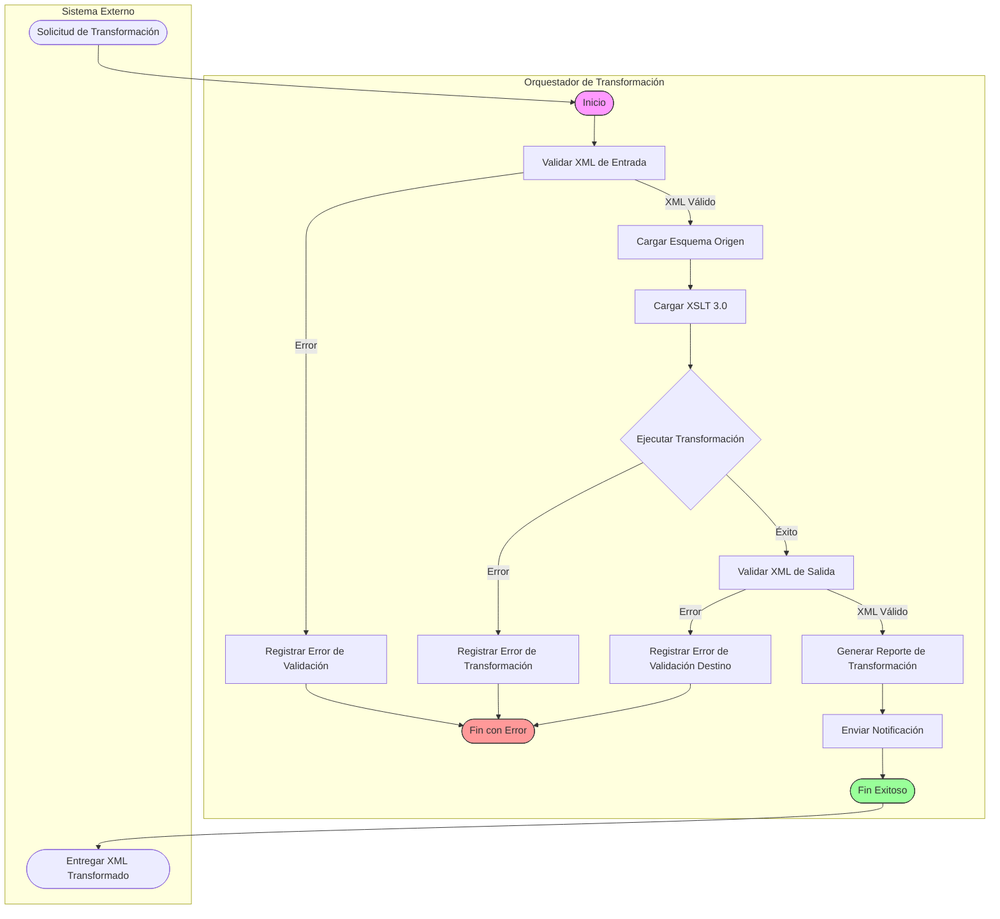
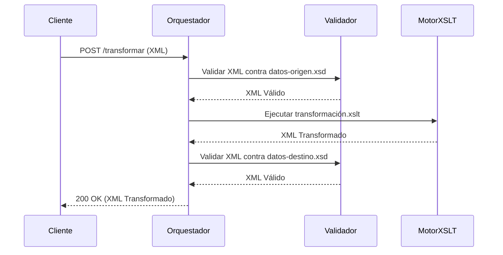

# Proceso de Transformación Bancaria - BPMN 2.0

## Descripción del Proceso
Este diagrama BPMN describe el flujo de negocio para la transformación de datos bancarios entre esquemas XML utilizando XSLT 3.0. El proceso es orquestado y sigue el patrón de integración SOA con validación estricta en cada etapa.

## Actores y Responsabilidades
| Actor                     | Responsabilidad                                                                 |
|---------------------------|---------------------------------------------------------------------------------|
| **Sistema Cliente**       | Envía la solicitud de transformación con XML de entrada                       |
| **Orquestador**           | Coordina el flujo completo, valida entradas/salidas y ejecuta la transformación |
| **Sistema de Validación** | Valida documentos XML contra esquemas XSD 1.1                                  |
| **Motor XSLT**            | Ejecuta la transformación con Saxon-HE 12.4                                    |

## Puntos de Decisión
1. **Validación XML de Entrada**
   - Si el XML no cumple con el esquema de origen (`datos-origen.xsd`):
     - Registrar error con código `VALIDACION_XML`
     - Detener proceso con estado `400 Bad Request`

2. **Transformación XSLT**
   - Si falla la transformación (ejemplo: función XPath no definida):
     - Registrar error con código `ERROR_TRANSFORMACION`
     - Detener proceso con estado `500 Internal Server Error`
   - Tiempo máximo de ejecución: 30 segundos (configurable)
     - Si se excede: registrar error `TIMEOUT` con estado `408 Request Timeout`

3. **Validación XML de Salida**
   - Si el XML no cumple con el esquema de destino (`datos-destino.xsd`):
     - Registrar error con detalles de validación
     - Detener proceso con estado `400 Bad Request`

## Reglas de Negocio
- **Transformación Condicional**:
  - Las transacciones con tipo `COMISION` deben ser agregadas en un nodo `<comisiones>` separado en el reporte.
  - Las cuentas de tipo `INVERSION` deben calcular intereses usando la función personalizada `banco:calcular-interes()`.

- **Agrupación de Datos**:
  - Las transacciones deben agruparse por tipo (`DEPOSITO`, `RETIRO`, etc.) y ordenarse por fecha descendente.
  - Las cuentas deben ordenarse alfabéticamente por número de cuenta.

- **Enriquecimiento de Datos**:
  - Cada transacción en el esquema de destino debe incluir un campo `categoria` derivado del tipo:
    | Tipo de Transacción | Categoría Asignada       |
    |----------------------|---------------------------|
    | DEPOSITO             | INGRESO                   |
    | RETIRO               | GASTO                     |
    | TRANSFERENCIA        | TRANSFERENCIA_INTERNA     |
    | COMISION             | COMISION                  |

## Métricas y Observabilidad
- **Tiempos de Ejecución**:
  - Validación entrada: umbral 500ms
  - Transformación: umbral 2000ms
  - Validación salida: umbral 300ms

- **Contadores**:
  - `transformaciones_exitosas`
  - `errores_validacion_entrada`
  - `errores_transformacion`
  - `errores_validacion_salida`

## Modos de Fallo y Mitigación
| Modo de Fallo                          | Impacto                          | Mitigación                                                                 |
|----------------------------------------|----------------------------------|----------------------------------------------------------------------------|
| XML de entrada mal formado             | Proceso detenido                 | Validación previa con esquema XSD 1.1 antes de transformación              |
| Función XPath personalizada no definida | Fallo en transformación          | Validación de funciones al cargar XSLT con `xsl:use-when`                 |
| Tiempo de ejecución excedido           | Proceso detenido                 | Configuración de timeout en Saxon-HE (30s) y monitoreo de métricas        |
| Esquema de destino no válido           | Reporte corrupto                 | Validación post-transformación con esquema destino antes de entrega        |
| Falta de recursos (memoria)           | Degradación del servicio         | Límites de tamaño de XML (10MB) y escalado horizontal del orquestador     |

## Extensiones del Proceso
- **Transformación por Lotes**:
  - El proceso puede extenderse para manejar múltiples archivos XML en una sola solicitud.
  - En este caso, se agregaría un paso adicional de **Descompresión** antes de la validación.

- **Transformación Diferida**:
  - Para archivos grandes (>10MB), se implementa un patrón de **cola de mensajes** donde:
    1. El cliente envía la solicitud y recibe un `jobId`.
    2. El orquestador procesa el archivo en segundo plano.
    3. El cliente consulta el estado con el `jobId`.

## Especificaciones Técnicas
- **Formato de Entrada**: XML 1.1 válido contra `datos-origen.xsd`
- **Formato de Salida**: XML 1.1 válido contra `datos-destino.xsd`
- **Motor XSLT**: Saxon-HE 12.4 con soporte para XPath 3.1
- **Extensiones Personalizadas**:
  - Funciones XPath definidas en namespace `http://banco.com/xslt/funciones`
  - Ejemplo: `banco:calcular-interes($monto, $dias)`
- **Modos XSLT**:
  ```xml
  <xsl:mode name="agrupar" on-no-match="shallow-copy"/>
  <xsl:mode name="ordenar" on-no-match="shallow-copy"/>
  ```

## Ejemplo de Flujo Completo
